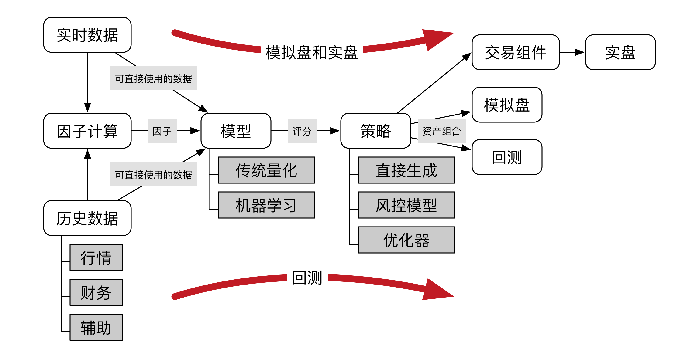

## 如何开展量化投资研究？

### 目录

* 怎样搞到数据？——巧妇难为无米之炊
* 怎样测量策略的性能？——搭建回测系统
* 怎样衡量量化策略的好坏？——一箩筐统计指标
* 开始挣钱！——从回测到实盘

现在市面上出现了很多供大家进行量化投资研究的网站，比如[Uqer](https://uqer.io)，[JointQuant](https://www.joinquant.com)，[BigQuant](https://bigquant.com)，[RiceQuant](https://www.ricequant.com)等，几乎清一色地在底层使用Jupyter Notebook环境来供大家进行量化投资研究。这些网站通常都为大家提供一些基本的量化投资所需要的数据，教大家使用一些基本的量化模型，并且提供封装好的数据接口、回测接口，甚至模拟盘和实盘接口。

ps. 突然发现京东也开始做量化投研了，跑去看了一下，大公司做的至少示例代码至少比其他家的规范。链接[JD Quant](https://quant.jd.com)。

在这些网站上进行量化投资的研究可以帮助大家很快速的了解量化投资的过程，把大家从繁琐的数据清洗、系统搭建中解放出来，能把更多的精力投入到策略的开发上来。但是其坏处就是，数据和回测等的封装让大家很难去了解到量化投资的工作细节，但是如果要想真正真枪实弹去市场上挣钱，除了有很好的想法之外，拼的就是这些细节。因此，要想严肃地来做量化投资研究，肯定还是需要自己对于这些底层的细节进行一定的了解。

个人并不反对在上面列举的这些第三方量化投研网站上面进行研究，不过这里主要讲一下如何自己在本地开展量化投资的研究。

量化投资的开发流程一般是：回测-模拟盘-实盘测试-实盘运行，我们这里主要讲第一个。

### 怎样搞到数据？——巧妇难为无米之炊

上一讲里面提到了，量化投资策略就是数据+量化模型。在第三方量化投研的网站上，数据通常以API的提供，使得你能够直接在网站内的Jupyter Notebook中访问。那么想要在本地进行量化投资研究的话，就需要通过网络API调用这些数据，或者把数据下载到本地再进行读取。

首先，讲一下我们可能用到的数据类型有哪些。可能用到的主要有以下几类数据

1. 历史日行情数据：即提供历史上每天每只股票的高开低收等价格信息以及成交量相关的信息，这也是量化中最基础的数据。通常能提供历史日行情数据的，几乎都能在当天交易日收盘之后提供更新的数据，因此也是实时更新的日行情数据。
2. 历史日内行情数据：即能提供历史上每一天中间更为细节的价量信息，通常为5分钟一个数据点，也有一分钟甚至半秒频率的数据。每个数据点的形式一般为该数据点代表时间段内的一个价量综合统计，包含高开低收和成交量信息。
3. 历史分笔数据：即历史上每一笔交易的明细，每一个数据点是一笔交易，记录了每一笔成交的价格、数量、时间等信息，是记录实际成交信息最为细致的数据。
4. 历史限价委托薄数据：记录了历史上每一个时刻限价委托薄的快照，每一个数据点代表一个时刻，每个数据点之间的间隔通常较小，比如0.5秒。每个数据点包含该时刻十档（或者五档）报价和挂单量等数据。限价委托薄数据是市面上反映盘口信息最为细致的数据。
5. 历史财务报表数据：提供各个公司所发布的财务报表数据，用于计算一些基本面因子。
6. 历史日度因子数据：提供历史上计算好的一些基本面和技术面因子，第三方提供的基本面和技术面因子通常都是一些市面上公开的因子。
7. 其他辅助数据：包括指数数据、指数成分数据、行业板块概念分类数据、个股基本信息等。
8. 其他特色数据：包括公告数据、新闻舆情热度数据、宏观经济数据等。

如果只是做回测，使用以上的数据就足够了，但是如果策略开发进行到了模拟盘甚至实盘的步骤，除了需要一个交易接口供你发出下单指令之外，你还需要以上数据的实时接口。因此，以上数据都对应相应的实时版本，这里不再一一介绍。需要注意的是，真正的实时分笔数据和实时限价委托簿数据好像交易所是不让分发的，大家看到的一般是延迟过后的数据。虽然以上很多数据都能找到免费的来源，但当你真正想要实盘的时候，还是建议去购买相应的数据，毕竟要是数据出了问题导致亏了钱，也是很心痛的。

下面介绍一些数据的来源。

* [tushare](http://tushare.org)：是一个免费、开源的Python接口，提供准实时和历史的行情，对于使用Python来开发的同学来说，使用起来比较方便。其工作原理是从本地出发抓取新浪财经的数据，因此延时较大。有几家量化投研网站的支持，数据源应该不会用一段时间就没了。提供除了上面3、4、6之外的数据。
* [easyquotation](https://github.com/shidenggui/easyquotation)：和上一个类似，是Github上面一个开源的Python工具，在本地抓取新浪财经、腾讯财经等数据源的数据。我没有用过。
* [万得资讯](http://www.wind.com.cn)：万得资讯也叫做wind，是业界认可度比较高的一家行情数据提供商，提供的数据也很全。好像有学生试用版，不过要是购买正式版的话还是很贵的。使用Wind可以把数据下载到本地再进行研究，也可以直接调用它提供的接口，我记得有Excel、C++和Python的接口。
* [恒生聚源](http://www.gildata.com)：与万得资讯类似，也是收费的。数据库很全面。
* [国泰安](http://www.gtarsc.com/Home/Index)：与万得资讯类似，也是收费的。个人没用过，不过看了一下，感觉数据很全面。
* [通联数据](https://mall.datayes.com/dashboard?lang=zh)：特点在于除了提供基本的行情和财务信息之外，还提供很多它自己计算好的因子数据。通联数据商城中有些数据是免费的或者免费试用的，不过还有很多数据是需要购买的。
* 有些第三方的量化投研网站是没有禁止你把相关数据下载下来的，你可以直接从上面下载。

### 怎样测量策略的性能？——搭建回测系统

有了数据之后，当然下一步是计算因子、建立模型并且设计交易策略了。因子、模型和策略这么重要的东西当然不会放在这一讲里面了\(^o^)/~。在经过这些步骤之后就能够进行回测了，概括起来流程如下图所示。

在这里，**因子**指的是利用数据构建的另一些可以直接用于模型的输入的数据；**模型**指的是利用算出来的因子和/或一些原始数据来得到一个对于个股/时间点进行评分，即输入是因子/数据，输出是评分；**策略**指的是根据模型输出的结果，来优化决策形成资产组合的配置。

股票市场的量化中，最为常见的就是每周调仓（或者说每几天调仓），在这种情况下，模型的目标就是每天选出五日期望收益率比较高的股票，策略的目标就是给出是的收益最大化的买卖股票列表和相应的数量。举个例子来说，模型的输入通常是这样的一堆数据

|ticker   |date     |factor1|factor2|factor3|...    |
|:--------|:--------|:------|:------|:------|:------|
|000001.SZ|20160104 |0.01   |0.21   |45.2   |...    |
|000001.SZ|20160105 |0.02   |0.31   |43.2   |...    |
|000002.SZ|20160104 |0.05   |-0.20  |15.2   |...    |
|000002.SZ|20160105 |0.06   |-0.14  |15.2   |...    |
|...      |...      |...    |...    |...    |...    |

模型的输出通常是这样的数据，同时这样的数据也是策略的输入

|ticker   |date     |score  |
|:--------|:--------|:------|
|000001.SZ|20160104 |0.32   |
|000001.SZ|20160105 |0.45   |
|000002.SZ|20160104 |0.54   |
|000002.SZ|20160105 |0.56   |
|...      |...      |...    |

策略的输出是这样的数据

|ticker   |date     |position|
|:--------|:--------|:-------|
|000001.SZ|20160104 |0.50    |
|000002.SZ|20160104 |0.50    |
|000001.SZ|20160105 |0.45    |
|000002.SZ|20160105 |0.55    |
|...      |...      |...     |

当有了策略的输出之后，下一步就是看一看回测效果如何。当然，如果策略是由模型输出简单生成的，我们也可以直接把模型的输出当做回测程序的输入。

最简单的回测程序一般就直接把每一期选出来的资产组合的权重向量${\bf w}_i$和这一期到下一期之间每只股票的收益向量${\bf r}_i$相乘即可，即，每一期投资组合的收益$r_{P, i} = {\bf w}_i^T \cdot {\bf r}_i$。但是这样简单的回测方式只能用于大致观察模型或者策略的效果，由于其得到结果的精度较差，无法用于对于模型和策略的定量分析。要想准确地测模型和策略的表现，就需要搭建一个比较完善的回测系统。

一个较为完善的回测系统需要满足以下的一些需求。

1. 能够指定股票池选股（比如选股范围可以为沪深300、中证500、中证800或者全市场选股，前三个可以分别使用000300、000905、000906成分股作为股票池）
2. 能够指定选择或者剔除ST股票
3. 处理停牌和退市：停牌期间该部分股票不能交易，退市之后按照退市规定处理手中相应的股票
4. 处理涨跌停
    * 涨停不能买入、跌停不能卖出
    * 指定能不能涨停卖出、跌停买入
5. 指定使用当日的哪一个价格来交易：twap、vwap、open还是close
6. 计算交易成本（印花税、手续费、冲击成本）
7. 每个调仓日股票先卖出再买入，每个交易日进行资产结算（仓位一般按照该日收盘价结算）
8. 如果输入是策略的输出，即已经指定好了目标持仓的配比，那么就根据往以该持仓为目标去进行模拟交易；如果给定的输入是模型的输出，通常先把该交易日模型预测出来的得分进行排序，然后选择排名靠前的股票来做多（也可以选排名靠后的做空）
9. 回测程序输出净值曲线、交易明细、每日持仓明细，净值曲线是回测最重要的输出，后两者是为了具体地查看最后生成策略的细节

看了这么多是不是手痒痒了，快自己写一个回测程序吧。

### 怎样衡量量化策略的好坏？——一箩筐统计指标

前面讲到量化的初步流程依次有因子计算、模型、策略、回测，最后输出了净值曲线。为了衡量整个流程的好坏，通常可以由净值曲线计算得到一些统计量，通过这些统计量来衡量整个量化流程的好坏。

#### 策略收益（Total Portfolio Return）

对于一个策略来说最重要的衡量指标就是该策略的盈利能力，策略收益是最为直接的反映策略绝对盈利能力的指标。

$$ Total Portfolio Return = r_p = (P_f - P_i) / P_i $$ 

其中$P_i$是策略最初的资产总量（包括股票总价值加上现金）；$P_f$是策略最后的资产总量。

#### 策略年化收益（Annualized Portfolio Return）

策略A的净值十年翻了一倍，策略B的净值一年就翻了一倍，但是他们的策略收益是一样的。这样比较显然不公平。换句话说，对于不同回测区间长度上的回测来说，需要在同一个尺度上比较，即看一看他们折合下来一年能赚多少。

$$ Annualized Portfolio Return = r_{p, ann} = (1 + r_p)^{\frac{250}{n}} - 1$$

其中$n$是回测期间的交易日天数，250是一年的交易日天数。

#### 策略年化波动率（Annualized Portfolio Volatility）

衡量策略的波动，定义为策略每年的收益率的波动范围

$$ Annualized Portfolio Volatility = \sigma_p = \sigma(R_p) = \sqrt{\dfrac{250}{n-1} \sum_{i=1}^n (R_{p,i} - \bar{R}_p)^2}$$

其中，$R_p$表示策略的收益率序列，$R_{p,i}$表示收益率序列中的每一个分量，$\bar{R}_p$表示收益率序列的平均值，$n$是回测期间的交易日天数。

#### 策略年化下行波动率（Annualized Downside Portfolio Volatility）

对于我们做做量化投资来说，如果收益率“往上”波动，其实我们并不介意，谁会介意多挣点钱呢？我们真正担心的“风险”其实是是下行风险，即收益率“往下”波动的情形。因此我们使用策略年化下行波动率来衡量下行风险。

$$ Annualized Downside Portfolio Volatility = \sigma_{p,d} = \sigma_d(R_p) = \sqrt{\dfrac{250}{n-1} \sum_{i=1}^n I(R_{p,i} < \bar{R}_p)(R_{p,i} - \bar{R}_p)^2} $$

其中指示函数

$I(x) = \begin{cases} 1 & x\text{ is True} \\ 0 & x\text{ is False} \end{cases}$

#### 基准收益（Total Benchmark Return）

除了直接比较策略的绝对收益之外，我们通常也关心在回测的这回测区间中整体的市场环境，即使用基准收益来衡量整体的市场环境。通常选用这个时期中某一个成分指数来作为基准，成分指数通常可以选择沪深300指数、中证500指数、中证800指数等，当然也可以选择这些成分指数对应的股指期货净值来计算。

$$ Total Benchmark Return = r_M = (I_f - I_i) / I_i $$

其中$I_i$是回测开始时的基准（指数或者股指期货净值）；$P_f$是回测结束时的基准。

#### 基准年化收益（Annualized Benchmark Return）

类似地，有基准年化收益

$$ Annualized Benchmark Return = r_{M, ann}= (1 + r_M)^{\frac{250}{n}} - 1$$

#### 基准年化波动率（Annualized Benchmark Volatility）

类似地，有基准年化波动率

$$ Annualized Benchmark Volatility = \sigma_M = \sigma(R_M)$$

其中，$R_M$表示基准的收益率序列，$\sigma(\cdot)$函数的定义和前面相同，$n$是回测期间的交易日天数。

#### 相对年化收益（Annualized Hedged Return）

策略A测量的是2015年上半年，策略B测量的是2015下半年。在2015年上半年就算是瞎猜也能赚到不少钱，但是在2015年下半年如果能保持净值就算是十分优秀的策略了。因此单纯比较它们的年化收益也是不公平的，我们需要把整体市场的因素剔除之后再对它们进行比较，这时我们就需要使用对冲年化收益来衡量策略的好坏了。

$$ Annualized Hedged Return = r_{p, hdg, ann} =  r_{p, ann} - r_{M, ann}$$

#### 相对年化波动率（Annualized Hedged Volatility）

相应的，有相对年化波动率

$$ Annualized Hedged Volatility = \sigma_{p, hdg} = \sigma(R_{p, hdg})$$

其中，$R_{p, hdg} = R_p - R_M$是相对收益率序列，$\sigma(\cdot)$函数的定义和前面相同。

#### 贝塔（Beta）

反映策略净值与市场波动的关联性，也是前面讲到CAPM中的$\beta$。加入一个策略$\beta = 0.5$，说明当市场总体上涨1%的时候，市场带给策略的收益率会有+0.5%；当市场总体下跌1%的时候，市场带给策略的收益率会有-0.5%。

$$ Beta = \beta_p = \dfrac{cov(R_p, R_M)}{var(R_M)} $$

其中$R_p$表示策略收益率序列，$R_M$表示相应的市场基准收益率序列（比如如果选择沪深300作为市场收益率基准，那么$R_M$就是沪深300指数的百分比增量序列）。这里大写字母表示是一个序列而不是一个数字。

当$Beta<0$时表明策略走向常常和市场方向相反，比如空头组合；$Beta=0$表明策略的收益与市场关联不大，比如固定收益类；$0<Beta<1$表明策略收益走向与市场相同，但是相较市场来说波动更小、风险更小；类似地$Beta\le 1$表明策略收益相较市场来说风向相差不多或者风险更大。

#### 阿尔法（Alpha）

其作用类似于前面讲的对冲年化收益，都反映的是扣除市场大环境之后的收益率。只不过这里阿尔法的计算以CAPM模型为基础。

$$ Alpha = \alpha_p =  r_{p, ann} - [r_f + \beta_p (r_{M, ann} - r_f)]$$

其中$r_f$为无风险利率，实际计算过程中可以把它当做定期存款利率或者把它当做零。

#### 夏普比率（Sharpe）

反映的是每承担一个单位的风险能够获得多少超额收益，是一个综合风险和收益的衡量指标。通常希望这个指标越大越好，这个指标也是量化策略评价中最为重要的一个指标。我们希望这个数值越大越好。

$$ Sharpe = (r_{p, ann} - r_f) / \sigma_p $$

#### 信息比率（Information Ratio）

夏普比率衡量的是策略绝对收益的收益风险特征，信息比率衡量的是策略相对收益的收益风险特征。

$$ Information Ratio = IR = (r_{p, ann} - r_{M, ann}) / \sigma_{p,hdg}$$

#### 索提诺比率（Sortino）

表示没承担一个单位的下行风险能够获得多少超额收益。

$$ Sortino = (r_{p, ann} - r_f) / \sigma_{p,d} $$

#### 最大回撤（Max Drawdown）

反映策略极端情况下的最大亏损

$$ Max Drawdown = MDD = \max_{i<j} \max((P_i - P_j) / P_i, 0)$$

其中$P$表示净值序列，它可以由收益率序列计算出来$P_i = \prod_{j=1}^i (1 + R_i)$。

#### 胜率（Winning Rate）

反映策略交易一次能够盈利的概率

$$WinningRate = \dfrac{\text{策略交易盈利次数}}{\text{策略交易总次数}}$$

当然前面讲的这些是对于整个流程的衡量方法，整个流程的效果是其中每一个步骤的加和。有时候我们还需要分别对于每一个步骤进行分析，希望看看到底是哪一个步骤制约了整体策略的性能。这时候就需要分别对于各个步骤进行性能的测量。

对于因子的计算来说，我们一般通过以下一些指标来衡量因子计算的好坏

#### 信息系数（Information Correlation，IC）

即在每一个横截面上计算因子数值和收益率之间的相关系数，相关系数的计算方法有两种，分别是[pearsonr](https://docs.scipy.org/doc/scipy/reference/generated/scipy.stats.pearsonr.html)和[spearmanr](https://docs.scipy.org/doc/scipy/reference/generated/scipy.stats.spearmanr.html)。注意到，信息系数是对于每一个时间截面都计算出来一个数值，因此会产生一个IC的时间序列，我们一般对这个时间序列计算均值，这个数值是研报中提到的IC。IC的绝对数值越大，相应的因子越好。很多研报里面为了区别这两种计算方式，又把后一种计算出来的信息系数成为rank IC。

#### 信息比率（Information Ratio，IR或者ICIR）

只计算IC序列的均值可能出现的问题是，有些表现不稳定的因子IC的均值也可能绝对值较大。为了综合考虑因子IC稳定性，可以通过ICIR指标来衡量。$ICIR=mean(IC) / std(IC)$，公式中$IC$指的是IC序列。

对于模型来说，也可以使用IC和ICIR来衡量模型的好坏，只需要把以上计算中因子的数值替换为模型输出的评分即可。

当然，对于流程中各个步骤的评判来说，也可以使用**控制变量法**来进行评判。即，只改变流程中的某一个步骤，同时控制流程中的其他步骤，直接观察整个流程的评价指标的变化。

#### 总结

看了这么多统计指标，头大。我们来总结一下，其中**加黑**的部分是需要重点关注的指标。

| 考察对象 | 统计指标 |
|:--------|:--------|
| 因子和模型 | **信息系数**、**信息比率** |
| 策略的收益特征 | **策略年化收益**、**相对年化收益** |
| 策略的风险特征 | 策略年化波动率、策略年化下行波动率、相对年化波动率、贝塔、**最大回撤** | 
| 策略的风险收益特征 | **夏普比率**、索提诺比率、阿尔法 |

### 开始挣钱——从回测到实盘

这一部分虽然写的不长，但其实这一步并不容易。经常出现的是回测中有很好的效果，但是一放到模拟交易或者实盘交易中表现就不如回测了。产生这种现象主要有两种常见的原因。

第一种原因是**未来信息**。在因子的构造、模型的计算、策略的组合以及回测中，都不能利用未来的信息来做决定。这种浅显的道理一说出来大家都明白，但是对于未来信息的利用有时候是十分隐蔽的，如果不仔细看很多时候难以发现。拿模型计算来说，最基本的防止对于未来信息的利用就是不能在未来的数据上进行参数拟合，然后把模型再用到过去的预测中。有些时候对于未来信息的利用会更为隐蔽，比如在回测的时候如果我们指定了沪深300成分股中选股，我们需要使用”那一时刻”的沪深300成分股，而不是“未来时刻”的沪深300成分股。再比如，对于ST股票的提出，我们需要使用“那一时刻”的ST股票。再比如，在因子计算过程中有时会利用到财报数据，很多时候财报在第一次公布的时候数据并不准确，上市公司会在之后的某个时刻修正之前已经公布的财报的数据。因子的计算就不能够使用这些看似更为准确的财报数据。

第二种原因是**过拟合**（overfitting）。我们前面提到，不能在未来的数据上拟合模型的参数，然后把它用于过去的决策。而过拟合其实是一种更为隐蔽的对于未来信息的利用，即在总的数据上调整模型中的超参数，然后人为选出使得策略效果最好的超参数，最后这样的超参数实际上又用于了过去的决策。虽然从某种程度上来说，过拟合也是一种隐式的利用未来信息，但是避免过拟合并不能像未来信息那样从源头上杜绝它。

模型中的超参数只有经过一定的调整才能真正反映模型的性能。举个例子，你想比较一辆兰博基尼和一辆奔驰，你肯定需要把这两辆车的发动机、轮胎、悬挂都调教好了再去比较。而调整的方法就是让车在路上跑一跑看看有没有调整好。汽车本身就像量化策略，而它们的发动机、轮胎等就好比是策略的超参数。

那怎么避免过拟合呢？方法就是把训练的数据分为两段，在一段独立的数据上面进行超参数的调整，调整好了之后再再另一段数据集上面进行测试。在前一段数据上调整好之后，再把模型放到后一段数据上评价，后一段数据上面的评价尽可能不要反馈到模型中，同时尽量减少在后一段数据上测试的次数。

当策略回测能够达到预期的效果，并且也尽力避免了未来信息和过拟合之后，我们就可以进行模拟交易的测试了。模拟交易的数据是股市最新的实时数据，这些数据是百分之百的样本外数据。如果策略能在这些数据上也表现仍然不错的话，也从结果上说明了之前的模型没有受到未来信息和过拟合的影响。

下一步我们就可以考虑实盘了。对于一些频率比较低的策略，比如一些月度调仓的策略，可以由策略生成结果之后，人工来完成相关的交易。但是稍微高频一些的策略则需要使用程序来自动完成，比如一些按周调仓的策略可能需要某一天以均价买入一定数量的某只股票，通过程序来实现底层的“以vwap/twap交易“使得交易的结果更有保障。相关的这些程序如何来编写又是一个比较大的topic了，以后有时间再来细讲。

最后放一些开源的交易接口供参考。

* [vn.py](http://www.vnpy.org)：是一个基于Python的开源实时交易接口
* [QuantBox](https://github.com/QuantBox/QuantBox_XAPI)：基于C、C++、C#的开源交易接口
