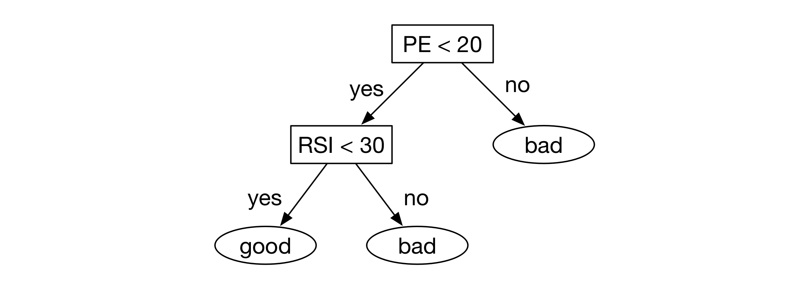

## 第四讲：机器学习如何与量化投资结合？

这一讲还在弄……

### 基本框架

机器学习通常可以分为**有监督学习**（supervised learning）、**无监督学习**（unsupervised learning）和**强化学习**（reinforcement learning）等。在二级市场的预测中，我们的目标通常是清晰明确的，即主要考虑盈利性；而盈利是十分容易通过给定的历史价格数据计算的，因此，在金融预测的应用中，我们通常使用有监督学习方式。有监督学习算法的输入是带有标注的训练数据集，有监督学习的输出是一个可以对于样本进行预测的模型，该模型可以接受一个输入样本并且给出一个关于该样本的预测。训练数据集一般包括许多个样本，每个样本通常包括两个部分。第一部分在机器学习的范畴内通常称之为**特征**（feature），在多因子模型框架下通常称之为**因子**（factor）。这一部分通常是是某个标的（在股票市场预测中即为某只股票）在某个调仓期及之前关于该标的诸多特性的描述，比如该股票的前5个交易日的价格移动平均（MA5）、该股票的市盈率（P/E）等。这一部分也可以包括一些该调仓期及之前关于宏观市场环境的描述，比如该时刻GDP的环比增长率、该时刻之前沪深300指数的变动等。不过需要注意的是如果使用了这一部分特征，这一部分特征在同一横截面上不同样本上的取值是相同的，它会给机器学习算法的运行带来一些比较特殊的效果，使用的时候需要比较注意。这里的**横截面**指的是同一个时间上的样本点。由于每个样本通常包含多个特征，因此第一部分也被称作该样本的**特征向量**。每个样本的第二个部分是该样本的**标签**，标签通常可以是一个实数值，比如该标的在未来一段时间内的收益；标签也可以是一个分类标记，比如该标的在未来一段时间是否能够盈利的标签，如果可以盈利就标1，不能盈利就标0。对于前一种情况，它对应的机器学习任务就是**回归任务**（regression）；对于后一种情况，它对应的机器学习认为是**分类任务**（classification），特别地，这一种分为两类的被称作二分类任务。

### 决策树模型

#### 基本原理

决策树算法的目标是形成一棵决策树。当一个样本到达决策树之后，它会根据决策树的指示，并且结合样本自身所包含的特征从决策树的根节点走到决策树的某个叶子节点，决策树对于该样本的分类就由该叶子节点所指示的分类表示。比如如下图所示的一棵决策树，它根据市盈率和RSI指标来对样本进行划分，如果某个样本满足``PE<20``和``RSI<30``两个条件，那么就会被划分到“好”类中。

正如上面提到的，决策树算法的输入仍然是一个有标签的训练数据集，输出是一个决策树。决策树算法用来构建决策树的方式如下。决策树的构建是从决策树的根节点往叶子节点进行的，在每一个节点上，决策树算法会选择一个可以最有效地进行分支的特征，然后基于该特征来分支。如果在某一个节点上1）没有可供选择的特征；2）该节点对应的训练样本的标签都相同；或者3）决策树已经达到规定的最大深度或最大节点数，那么就不再往下进行分支。这个节点就被当做叶子节点，其对应的分类为该节点下简单多数训练样本的标签。

对于决策树模型而言，有后剪枝和预剪枝方法来避免过拟合。

#### 优点

* 模型能够反应具有层级结构的逻辑，比如对于大盘股和小盘股分别观察不同的特征并且做出不同的判断（即，在上级节点按照市值来分类，在不同分支下再使用不同的方式来判断）。
* 能够支持样本的某些特征为缺失值；能够支持连续和离散的特征混合使用。因此，对于金融的数据而言，可以不对特征做出填充缺失值、标准化等预处理工作，直接把数据传入进行训练。
* 效果较差的特征的加入不会过于影响模型的性能，不过会降低模型训练的速度。

#### 缺点

* 在回归任务中每个叶子节点的数值为该叶子节点下样本标签的平均值，当树规模较小的时候，回归任务的精度可能较差。但是以决策树为基础的梯度提升树算法（gradient boosted tree）和随机森林算法（random forest）可以在回归任务上也有比较好的性能。
* 决策树所形成的分类边界是轴平行的，即所形成的分类边界是由多段与特征空间坐标轴平行线段组成的。即，每次决策树的分支都只能基于单一特征来进行，不能对于多个特征进行组合。多变量决策树（multivariate decision tree）模型可以对进行形如$\sum_i w_i f_i$的特征的线性组合进行分类。其中$f_i$表示某个特征，$w_i$表示相应的线性组合权重。

### 支持向量机

#### 基本原理

支持向量机算法可以解决二分类问题和回归问题。

对于二分类问题而言，支持向量机的主要目标是得到一个分类超平面$\bf{w}^T \bf{x} + b = 0$来对于样本进行划分，其中$\bf{w}, b$是需要学习的参数，$\bf{x}$是样本的特征向量。当给定一个样本输入的时候，我们计算该样本的$f(\bf{x})= \bf{w}^T \bf{x} + b$，如果$f(\bf{x})>0$就把它标为正样本，反之标位负样本。而对于回归问题而言，支持向量机的目标就是找到形如$f(\bf{x})= \bf{w}^T \bf{x} + b$的函数，并且直接把$f(\bf{x})$作为预测的输出。

支持向量机算法通过解一个优化问题来找到这样一个分类的超平面，优化问题的目标可以概括为尽量找到一个超平面来把正负样本分开。更进一步地，该算法不仅希望能把正负样本用一个超平面分开，而且希望离该超平面最近的样本到超平面的距离尽可能的远，这个距离称之为**间隔**（margin）。一类支持向量机算法要求找到一个超平面能够完全把训练集上的正负样本分开，这种方法称为**硬间隔**（hard margin）。在实际情况中，常常不存在这样一个超平面能够把训练集上的样本完全分开，那么我们对于能够完全被超平面正确分开的样本不给予损失，对于不能被该超平面正确分开的样本给予一个非负损失值，并且在优化的时候考虑最小化总的损失值。这样的方法称为**软间隔**（soft margin）。

支持向量机还可以采用核方法（kernel method），这样对于样本划分的分类边界就不再局限于平面形式，还可以为参数控制的曲面形式了。常用的核有线性核（对应的就是上述的超平面）、多项式核、高斯核、拉普拉斯核以及sigmoid核。

#### 优点

* 具有许多成熟的软件包，比如LIBSVM、sklearn中的实现等，应用起来比较方便。
* 虽然训练的过程比较慢，但是训练得到模型是一个容易理解的公式，同时模型的计算使用也比较迅速。

#### 缺点

* 当样本数目很大的时候，训练时间将会非常长。
* 在分类问题中，支持向量机是针对二分类任务设计的，如果需要进行多分类任务，需要专门的推广。
* 支持向量机核函数的选择直接决定了算法的最终性能，但支持向量机核函数的选择没有确定的理论依据或者方法。
* 不适合离散的特征作为输入。

### 贝叶斯模型

#### 基本原理

贝叶斯模型指一类从概率视角出发构建的模型，这里主要介绍几类贝叶斯分类模型，包括朴素贝叶斯模型、半朴素贝叶斯模型和贝叶斯网；另外从概率视角出发还可以对于其他模型进行改造，比如贝叶斯线性回归。

对于贝叶斯分类器来说，其目标是使得分类正确的概率尽可能大，即贝叶斯分类器可以写作$h({\bf x})=arg \max_{c \in \mathcal{Y}} P(c|{\bf x})$，其中$\bf x$表示某样本的特征向量，$c$表示对于该样本考虑其可能的分类标签。考虑贝叶斯公式，可以将其进一步写为

$$h({\bf x})=arg \max_{c \in \mathcal{Y}} \dfrac{P(c) P({\bf x}|c)}{P({\bf x})}$$

因此，贝叶斯模型学习的目标就是基于训练数据集对于$P(c)$和$P({\bf x}|c)$给出一个好的估计。上式的分母部分可以看做一个归一化因子，可以不做估计。$P(c)$可以通过各类样本在训练数据集中出现的频率来进行估计。贝叶斯分类算法的关键在于对$P({\bf x}|c)$的估计。诚然，我们可以仿照对$P(c)$的估计，使用在给定标签为$c$的样本中不同的特征向量出现的概率来作为$P({\bf x}|c)$的估计。但是特征向量$\bf x$可能取值的数目相对于特征向量的维度呈指数级的递增，因此照这种方式来估计会面临组合爆炸、样本稀疏的问题，因此通常并不采用这种直接估计的方法。

**朴素贝叶斯分类器**引入了**属性条件独立性假设**（attribute conditional independence assumption），即认为每个属性独立地对分类结果产生影响。在此情况下有$P({\bf x}|c) = \prod_{i=1}^d P(x_i|c)$，其中$d$表示特征向量的维数。我们只需要对于每一个特征独立进行估计即可。

**半朴素贝叶斯分类器**引入了**独依赖假设**（one-dependent assumption），即认为每个特征对于分类结果的影响在该特征的取值之外最多仅依赖于一个其他特征。再次情况下有$P({\bf x}|c) = \prod_{i=1}^d P(x_i|c, x_{d(i)})$，其中$d(i)$是是第$i$个特征所依赖的特征的编号。在除了对于每一个$P(x_i|c, x_{d(i)})$进行估计之外，半朴素贝叶斯分类器还需要对于每个特征找到它最可能依赖的另一个特征。

**贝叶斯网**认为各个特征之间可以存在任意的依赖关系，各个特征之间可以构成一个依赖网络（即贝叶斯网），有了这样的依赖网络，当给定一个样本的特征向量时，就可以推断估计出所需要的$P({\bf x}|c)$。在贝叶斯网的构建中，通常有定义一个评分函数用来衡量贝叶斯网与训练数据集的契合程度，算法的目标就是找到一个贝叶斯网使得它与训练数据集最为契合，同时也希望找到的这个贝叶斯网不要太过于复杂。其中涉及到两个方面，即学习贝叶斯网的参数和学习贝叶斯网的结构：参数的学习较为简单，通过频次的统计即可得到；但是找到最优的贝叶斯网结构被证明是十分困难的，有许多不同的方法来近似地求解这样的结构。通过贝叶斯网络来精确推断$P({\bf x}|c)$同样被证明是非常难的，我们通常通过吉布斯采样的技术来对其进行推断。

#### 优点

* 从概率的视角出发来解决问题，对于问题解的估计比较准确，同时也降低了过拟合风险。
* 朴素贝叶斯模型和半朴素贝叶斯模型虽然引入了一些假设条件，不过在很多实际的情形下虽然不满足这样的假设，模型仍然可以取得较好的结果。其中可能的原因是不同特征间的依赖关系产生的影响可能被抵消。
* 贝叶斯网具有强大的表示能力和良好的可解释性。

#### 缺点

* 贝叶斯方法的计算复杂度比较高，尤其是贝叶斯网络，计算量很大，并且找到一个最优的解被证明是十分困难的。

### 聚类模型

#### 基本原理

聚类是一类无监督学习方法，它主要目的是把数据中的样本划分为若干个通常是不相交的子集，每个子集称之为**簇**（cluster）。根据聚类的方式不同，聚类算法主要可以分为基于原型的聚类（prototype-based clustering）、基于密度的聚类（density-based clustering）和层次聚类（hierarchical clustering）。其中比较常见的算法有k均值算法（K-means）、学习向量量化（Learning Vector Quantization）和高斯混合聚类（mixture of Gaussian）等，它们属于上述第一类方法。

#### 优点

* 在没有标签的情况下，仍然可以对数据进行一定的学习，找出数据中的潜在规律。

#### 缺点

* 它的最终目的是把样本划分为不同的类别，划分出来类别的具体含义不能事先确定。因此它不能够直接用于做预测或者交易信号，它在金融领域主要作用主要是用于一些任务的预处理，比如根据不同股票价格的运动形态将股票聚类，形成的聚类形式可能是股票所属的不同行业。
* 聚类得到的不同簇的具体含义不能事先给定，只能通过聚类之后人为观察给定其含义。