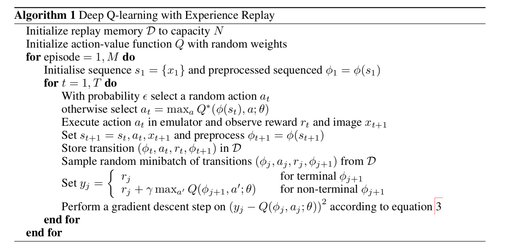
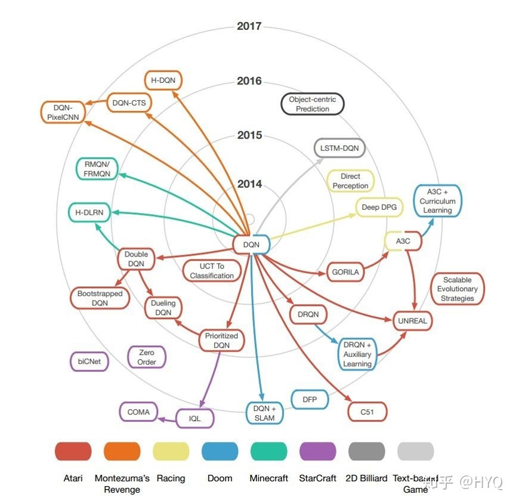
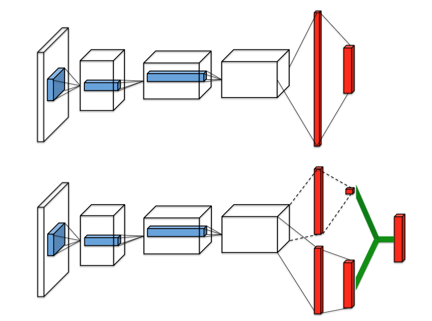

## 第六讲：强化学习策略迭代类方法

### 目录

* 初识时间差分方法 —— TD(0)
* 从少量状态到数不清的状态 —— 函数逼近技术
* 从TD(0)到MC的过渡 —— TD($\lambda$)
* 用强化学习来玩游戏 —— DQN

### 引言

强化学习的目标是找到能够最大化收益的策略，其中一类重要的方法是策略迭代类的方法。这类方法的的主要特征是采用了Sutton的强化学习书中提到的GPI（generalized policy iteration）框架。这类方法都包含两个步骤的交替进行，在策略改进步（policy improvment）中，根据学到的价值函数产生这个价值函数下较好的策略；在策略评价步（policy evaluation）中，估计新产生策略对应的价值函数。前一讲中的Modified Policy Iteration算法是这类方法的一个草图。

在这一讲中，主要介绍**时间差分方法**（temperal-different method, TD），它结合了MC方法model-free的特点和DP方法bootstrap的特点。我们先介绍on-policy和off-policy情形下的TD(0)算法。接下来我们会拓展到状态空间、行动空间连续（或者指数级多）的情形，在这种情形下每个状态的价值函数不再是单独储存而是用函数去对其拟合。我们还将介绍TD($\lambda$)算法，通过它可以自然地从$TD(0)$过渡到MC方法。最后我们介绍策略迭代类方法里面十分具有影响力的一篇工作DQN。

### 初识时间差分方法 —— TD(0)

回顾前面的两种方法，DP方法需要直接使用对于环境的建模（即，需要使用$p(s',r\|s,a)$），而MC方法可以直接从与环境的交互经历中间来学习，它不需要知道对于环境的建模或者估计一个关于环境的模型（即，不需要使用或者估计$p(s',r\|s,a)$）。对于类似DP这样需要对环境建模的方法我们称之为**model-based**方法；对于类似MC这样不需要对环境建模的方法我们称之为**model-free**方法。同时，我们还注意到，在DP方法中，对于某个状态$s$的价值函数的估计需要使用到对于其后续状态$s'$的价值函数估计值；而在MC方法中，对于某个状态$s$的价值函数的估计来自于一整条抵达终止状态的链的实际收益，它不依赖其他状态的价值函数估计值。对于像DP这种对于一个状态价值函数估计的更新需要依赖其他状态价值函数估计的性质，我们称之为**bootstrap**。这里介绍的TD方法既像MC一样有model-free的特点，也像DP一样有bootstrap的性质。

回顾DP方法，DP方法在更新某个状态$S\_t$的价值函数估计值的时候需要根据状态$S\_t$后续所有可能状态$S\_{t+1}$的价值函数估计值来更新，这种方式叫做**full backup**。MC方法在更新某个状态$S\_t$的价值函数估计值的时候，只需要对于后续状态进行采样，使用一个后续状态$S\_{t+1}$的价值函数估计值来更新即可，这种方式叫做**sample backup**。考虑知道了当前的状态$S\_t$和目前该状态的价值函数估计值$V(S\_t)$，在通过策略$\pi$行动之后到达了下一个状态$S\_{t+1}$，同时取得了短期的奖励$R\_{t+1}$。不难推出，相比于$V(S\_t)$，$R\_{t+1} + \gamma V(S\_{t+1})$是一个更好的估计值，因此在每一步中，我们都把估计值$V(S\_t)$往这个更好的方向更新一点，因此我们可以得到**TD误差（TD error）**和价值函数更新公式。

$$\delta_t = R_{t+1} + \gamma V(S_{t+1}) - V(S_t)$$

$$V(S_t) \leftarrow V(S_t) + \alpha \delta_t$$

与MC方法类似，TD方法也有on-policy和off-policy的版本，这里先给出他们各自的算法框图。

$$
\begin{aligned}
& \text{算法四：SARSA: on-policy TD Method} \\
1\quad & \text{initialize } \forall s \in \mathcal{S}, a \in \mathcal{A}(s)\\
2\quad & \quad Q(s, a) \leftarrow \text{arbitrary}  \\
3\quad & \quad Q(\text{terminal-state}, \cdot) \leftarrow 0 \\
4\quad & \text{repeat for each episode:} \\
5\quad & \quad \text{initialize } S \\
6\quad & \quad \text{choose }A\text{ from }S\text{ using policy derived from }Q\text{ (e.g. }\epsilon\text{-greedy)} \\
7\quad & \quad \text{repeat (for each step of episode):} \\
8\quad & \quad \quad \text{tack action }A\text{ observe }R, S' \\
9\quad & \quad \quad \text{choose }A'\text{ from } S' \text{ using policy derived from } Q\text{ (e.g. }\epsilon\text{-greedy)}\\
10\quad & \quad \quad Q(S, A) \leftarrow Q(S, A) + \alpha [R + \gamma Q(S', A') - Q(S, A)] \\
11\quad & \quad \quad S \leftarrow S', A \leftarrow A' \\
12\quad & \quad \text{until } S \text{ is terminated} \\
\end{aligned}
$$

$$
\begin{aligned}
& \text{算法五：Q-learning: off-policy TD Method} \\
1\quad & \text{initialize } \forall s \in \mathcal{S}, a \in \mathcal{A}(s)\\
2\quad & \quad Q(s, a) \leftarrow \text{arbitrary}  \\
3\quad & \quad Q(\text{terminal-state}, \cdot) \leftarrow 0 \\
4\quad & \text{repeat for each episode:} \\
5\quad & \quad \text{initialize } S \\
6\quad & \quad \text{choose }A\text{ from }S\text{ using policy derived from }Q\text{ (e.g. }\epsilon\text{-greedy)} \\
7\quad & \quad \text{repeat (for each step of episode):} \\
8\quad & \quad \quad \text{tack action }A\text{ observe }R, S' \\
9\quad & \quad \quad \text{choose }A'\text{ from } S' \text{ using policy derived from } Q\text{ (e.g. }\epsilon\text{-greedy)}\\
10\quad & \quad \quad Q(S, A) \leftarrow Q(S, A) + \alpha [R + \gamma \max_a Q(S', a) - Q(S, A)] \\
11\quad & \quad \quad S \leftarrow S', A \leftarrow A' \\
12\quad & \quad \text{until } S \text{ is terminated} \\
\end{aligned}
$$

可以看到，在TD方法中，个体和环境的每产生一次交互，程序都会更新相应的价值函数。在SARSA（on-policy方法）中，目标策略和行动策略都是关于行动价值函数$Q(s,a)$的$\epsilon$-greedy策略；在Q-learning（off-policy方法）中，行动策略是关于$Q(s,a)$的$\epsilon$-greedy策略，而目标策略是关于$Q(s,a)$的greedy策略。

这里可以总结出TD方法的几个优势。首先，如同MC一样，它不需要关于环境的建模，是一种model-free的方法。其次，它在和环境的每一步交互过后都进行相应的计算，是一种完全的增量形式；与之相反的是MC方法，它需要在一个回合结束过后集中进行运算，在很多应用场景中，这是一个比较低效的方式。另外，对于有限状态的情形下（状态数目不多，以至于能够使用离散的$V(S)$或者$Q(S,A)$存储），可以证明算法的收敛性。最后，在经验上TD算法的收敛速度在很多情况下比MC和DP方法更快。

为了区别于后面会讲到的另一类TD($\lambda$)算法，我们将这种只往后看一步的方法称作TD(0)。

最后引用一下Sutton书中的一句话来说明TD算法思想在强化学习领域的重要性。

> If one had to identify one idea as central and novel to reinforcement learning, it would undoubtedly be temporal-difference (TD) learning.

### 从少量状态到数不清的状态 —— 函数逼近技术

至此，我们对于状态价值函数和行动价值函数的表示都是针对不同的状态分别储存一个数值，并且把它们当做不同的情形来更新的。这种方式我们称之为**表格方法**（tabular solution method），因为我们对于每个状态都创建了一个价值函数，在价值函数这个表格的不同格子上更新相应的价值函数。但是在很多情形下，状态可能是连续分布的，这就导致状态数目可能是无穷多的，比如一条线段上的的位置；在另外一些情形下，状态可能是通过排列组合产生的，比如100个不同颜色小球的排列，这样的情形可能产生巨大的状态数目。当我们对每个状态都采用一个格子来储存他们的价值函数时，要么遍历一遍所有的状态会消耗巨大的计算资源（比如，DP算法中需要对于某个状态的后续所有可能的状态遍历），要么在很长的计算时间内，总有大量的状态一次都不能被更新到（比如，MC或者TD算法中虽然并不要求每次迭代遍历所有的状态，但是有些状态一次都不能被访问到会导致算法性能大幅下降）。

当我们遇到无穷或者庞大的状态集的时候，我们需要采取**近似方法**（approximate solution method）。我们通常使用一组参数来控制相应的状态价值函数（如果是行动状态函数也是类似的处理方法），我们把状态价值函数$v(s)$写成$v (s, \mathbf{w})$的形式，它的具体形式可以根据不同任务而不同，比如最简单的也是我们下面讨论中默认的一种形式——线性近似（linear approximation）$v(s, \mathbf{w}) = \mathbf{w}^T \mathbf{x}(s)$，其中$\mathbf{w}$和$\mathbf{s}$是维度相同的向量，最常见的$\mathbf{x}(s)$可以使one-hot形式的向量，表示该状态处于某个状态组中。因此当我们要更新状态价值函数的估计值时，我们不再对于某一个格子上的数值直接进行更新，而是对于参数$\mathbf{w}$进行更新。参数的更新公式可以通过对$(G\_t - v(S\_t, \mathbf{w}\_t))^2$求导得到，其中$G\_t$是得到的$v(S\_t)$的目标值。

$$\mathbf{w}_{t+1} = \mathbf{w}_t + \alpha [G_t - v(S_t, \mathbf{w}_t)] \nabla_w v(S_t, \mathbf{w}_t)$$

我们可以使用采样方法得到$G\_t$，此时$G\_t$是无偏估计，因此上式的后一项是真实的梯度；我们还可以使用bootstrap的方法来得到$G\_t$，比如$G\_t = r\_t + \gamma v(S\_{t+1}, w\_t)$，但由于这个目标还依赖其他的价值函数值，而这些价值函数的值又同时依赖参数$w\_t$，为了计算简便我们不再考虑目标值中关于参数的梯度，这样的近似产生**半梯度方法**（semi-gradient method）。

由此我们能够写出在半梯度方法下TD(0)的更新公式。可以证明它在线性近似和on-policy的情形下是可以收敛的。

$$
\mathbf{w}_{t+1} = \mathbf{w}_t + \alpha [R_{t+1} + \gamma v(S_{t+1}, \mathbf{w}_t) - v(S_t, \mathbf{w}_t)] \nabla_{\mathbf{w}} v(S_t, \mathbf{w}_t)
$$

当然，这样的近似价值函数还可以使用更为复杂的形式来表示，比如使用决策树或者神经网络等。不过值得注意的是，在表格方法中很多算法都能够有较好的收敛保证，但是在函数逼近方法下很多算法都十分不稳定，尤其是当算法中同时包含**函数逼近技术、bootstrap和off-policy**时，算法在理论和实践上都很难保证稳定。而这三者都十分的重要，函数逼近技术让我们能够解决状态空间复杂的问题；bootstrap大幅提高的算法的效率；而off-policy让我们能够更好地控制算法的探索，这对于学习到一个好的策略十分重要。而这三者的结合却很容易导致算法的发散，Sutton在书中称它们为**The Deadly Triad**。

算法的收敛性保证、实践上算法的稳定性以及算法的效率是应用到函数逼近技术强化学习算法的核心问题。off-policy下算法的不稳定主要是由于1）行动策略得到目标和目标策略所需目标的不一致，这个问题可以通过前面提到的重要性采样率来解决；2）行动策略产生数据的分布和算法所需要的分布不一致，这个问题是目前比较困难的问题。为了应对在off-policy上不稳定的问题大致上有两类思路：第一类思路是去设计一种真实的梯度方法，而不是前面提到的半梯度方法，因为半梯度方法的收敛性依赖于数据的on-policy分布；第二类思路是得到行动策略采集到的数据之后，对其进行加权，使其分布看起来像一个on-policy策略得到的数据分布。有如下几种尝试解决的方法：

1. **MC方法**：使用蒙特卡洛方法来更新公式$\mathbf{w}\_{t+1} = \mathbf{w}\_t + \alpha [G\_t - v(S\_t, \mathbf{w}\_t)] \nabla\_w v(S\_t, \mathbf{w}\_t)$里面的$G\_t$，所得到的梯度是真实的梯度，能够在off-policy情形下保证稳定。但是这种做法的缺点在于效率低。
1. **Naive Residual Gradient Algorithm**：直接对Mean Squared TD Error $\overline{TDE}$求梯度，并且做梯度下降，其更新公式为$ \mathbf{w}\_{t+1} = \mathbf{w}\_t + \alpha \delta\_t (\nabla\_w v(S\_t, \mathbf{w}\_t) -\gamma \nabla\_w v(S\_{t+1}, \mathbf{w}\_t)) $，它相比于Semi-gradient TD(0)方法唯一的不同就是后面多出了减去的一项，之前的半梯度方法没有能够考虑到$G\_t = R\_{t+1} + \gamma v(S\_{t+1}, \mathbf{w}\_t)$里面后一步估计产生的梯度，而这里就将这一部分梯度补上了，使其成为了一个真实的梯度。这个方法能够稳健的收敛，但是其问题在于最小化$\overline{TDE}$之后收敛到的并不是正确的价值函数；换句话说，价值函数在其真实取值的时候对应的$\overline{TDE}$并非最小。
1. **Residual Gradient Algorithm**：当价值函数在真实取值的时候，对应的Bellman error为零，**Bellman error是TD error的期望**。因此我们对Bellman Error $\overline{BE}$来求梯度，并且做梯度下降，这样得到的方法就是Residual Gradient Algorithm，其更新公式为$ \mathbf{w}\_{t+1} = \mathbf{w}\_t + \alpha \left[ \mathbb{E}\_b[\rho\_t (R\_{t+1} + \gamma v(S\_{t+1}, \mathbf{w}\_t))] - v(S\_t, \mathbf{w}\_t)) \right] \left[ \nabla v(S\_t, \mathbf{w}\_t) -\gamma \mathbb{E}\_b[\rho\_t \nabla v(S\_{t+1}, \mathbf{w}\_t)] \right] $。需要注意的是这里面有两个期望，这两个期望里面的采样需要是独立的。这个方法的缺点在于：1）慢；2）仍然收敛到的可能不是正确的价值函数；3）最重要的在于$\overline{BE}$不是**可学习**（learnable）的。不同的MDP可以产生相同的数据（包括state、action、reward序列），但是它们却对应不同的$\overline{BE}$，因此我们无法单独从数据中学习到$\overline{BE}$，这种情况我们称之为不可学习的。
1. **Gradient-TD Method**：前面给我们的启示就是我们需要找一个可学习的目标，然后对其优化。函数逼近技术中权值$\mathbf{w}$的维度比状态数目一般要小，因此某种函数逼近方法只是在价值函数空间中的一个子空间，把Bellman Error投影到这个子空间上，得到的就是Projected Bellman Error $\overline{PBE}$，它是可学习的。对$\overline{PBE}$做梯度，可以得到权值的更新公式（线性近似）$\mathbf{w}\_{t+1} = \mathbf{w}\_t + \alpha \rho\_t (\mathbf{x}\_t - \gamma \mathbf{x}\_{t+1}) \mathbf{x}\_t^T \mathbf{v}\_t$ 和 $\mathbf{v}\_{t+1} = \mathbf{v}\_t + \beta \rho\_t (\delta\_t - \mathbf{v}\_t^T \mathbf{x}\_t)\mathbf{x}\_t$，增加了一个变量$\mathbf{v}\_t$是把公式中的一个Least Mean Square的解的形式换成了梯度下降形式。这一类方法是目前使用最为广泛的稳定off-policy方法。
1. **Emphatic-TD Method** [2,3]：前面的思路都是寻找一个好的优化目标并且求出其正确的梯度，这个方法使用了另一种思路，即使用行动策略进行采样之后，对于不同的状态进行不同的加权，使其看起来像是on-policy的分布。其权值更新公式为$ \mathbf{w}\_{t+1} = \mathbf{w}\_t + \alpha M\_t \rho\_t \delta\_t \nabla v(S\_t, \mathbf{w}\_t) $，这里的$M\_t$就是动态更新的对于某个状态的权重，把样本的等效分布调整为和on-policy分布一致。

### 从TD(0)到MC的过渡 —— TD($\lambda$)

回顾前面的TD和MC方法，在TD方法中，每次都把当前的状态价值函数都往一个更为合理的状态价值函数估计值$G\_t^{(0)} = R\_{t+1} + \gamma v(S\_{t+1}, \mathbf{\theta})$上更新；在MC方法中，我们每次实际上是将状态价值函数估计值往$G\_t^{(T-t)} = R\_{t+1} + \gamma R\_{t+2} + \gamma^2 R\_{t+3} + \cdots + \gamma^{T-t} R\_T$上更新。我们其实可以定义$n$步的TD算法，使得其目标收益估计为

$$G_t^{(n)} = R_{t+1} + \gamma R_{t+2} + \gamma^2 R_{t+3} + \cdots + \gamma^n v(S_{t+n}, \mathbf{\theta}), 0\le t\le T-n$$

实际上对于$G\_t^{(n)}$的任意归一化的加权组合都能够形成可行复合收益估计，比如$\frac{1}{4}G\_t^{(1)} + \frac{3}{4}G\_t^{(2)}$。这里我们定义一种特殊的复合收益估计，称之为**$\lambda$-收益**（$\lambda$-return）

$$G_t^\lambda = (1-\lambda) \sum_{n=1}^\infty \lambda^{n-1} G_t^{(n)}$$

其中$0\le\lambda\le 1$，根据$\lambda$取值的不同，$\lambda$-收益对应的实际上是从MC方法到前述TD方法（也称TD(0)方法）的过渡。当$\lambda = 0$时，$\lambda$-收益对应的就是一步的TD方法；当$\lambda = 1$时，$\lambda$-收益对应的就是MC方法。

至此我们已经看到了$\lambda$-收益是TD(0)方法到MC方法的过渡，不过更为精彩的地方在于，$\lambda$-收益的这种定义方式让我们能够更加方便地对于涉及到未来多步奖励的目标进行权重更新。考虑一串连续的动作$S\_t, A\_t, R\_{t+1}, S\_{t+1}, A\_{t+1}, \cdots$，如果我们希望对于未来$n$步的奖励进行统计，然后更新权重，我们就必须等到$n$步之后才能得到完整的奖励序列之后再进行更新，而在此之前将无事可做；更进一步，如果$n\to \infty$，那么我们只能像MC方法一样，等到回合结束之后再回过头来更新权重。那有没有什么方法让我们每一步都做尽可能的更新呢？这样权重每一步都在更新，并且最新的信息都能被及时利用。这就要引出eligibility trace技术了。

这种技术可以将运算量从集中地在每次回合结束时进行变为分散在每一步之中进行，大致思想是将“往后看”变为“往前看”，**不像之前那样认为更新这一步需要后$n$步的奖励，现在认为这一步刚刚得到的奖励马上可以用于更新前$n$步内所有的权重**。定义eligibility trace $\mathbf{e}$，在函数逼近技术下，它是与权值$\mathbf{w}$维度相同的向量，它记录了历史中每一步的所经历的状态的累积，通过更新它，可以使我们能够先记录走过的路径，在最后得到相应的奖励之后，再往正确的方向更新。换句话说，权重$\mathbf{w}$是对于到此为止所有经历的长期记忆，而$\mathbf{e}$是对于最近几步的短期记忆。

我们这里举一个最为简单的例子来说明eligibility trace技术是如何应用的。$\mathbf{e}$初值为0，每次都会累积一个当前状态下价值函数相对于权重的梯度，即

$$
\begin{aligned}
& \mathbf{e}_{-1} = \mathbf{0} \\
& \mathbf{e}_t = \gamma \lambda \mathbf{e}_{t-1} + \nabla \widehat{v} (S_t, \mathbf{w}_t)
\end{aligned}
$$

每一步最新的TD误差为

$$
\delta_t = R_{t+1} + \gamma \widehat{v}(S_{t+1}, \mathbf{w}_t) - \widehat{v}(S_t, \mathbf{w}_t)
$$

权重的更新就累加TD误差和eligibility trace的乘积，

$$
\mathbf{w}_{t+1} = \mathbf{w}_t + \alpha \delta_t \mathbf{e}_t
$$

这样得到是的**semi-gradient version TD($\lambda$)算法**。

$$
\begin{aligned}
& \mathbf{e}_{-1} = \mathbf{0} \\
& \mathbf{e}_t = \gamma \lambda \mathbf{e}_{t-1} + \nabla \widehat{v} (S_t, \mathbf{w}_t) \quad \text{(accumulating trace)}\\
& \delta_t = R_{t+1} + \gamma \widehat{v}(S_{t+1}, \mathbf{w}_t) - \widehat{v}(S_t, \mathbf{w}_t) \\
& \mathbf{w}_{t+1} = \mathbf{w}_t + \alpha \delta_t \mathbf{e}_t
\end{aligned}
$$

这个算法是一个on-line的算法，但是这个算法对于off-line版本$\lambda$-收益的模拟不是很好，另外一种更逼近off-line版本$\lambda$-收益的算法是**True Online TD($\lambda$)算法**（with linear function approximation），这里的“true online”指的是它是对于一个off-line目标的online实现。

$$
\begin{aligned}
& \mathbf{e}_{-1} = \mathbf{0} \\
& \mathbf{e}_t = \gamma \lambda \mathbf{e}_{t-1} + (1-\alpha \gamma \lambda \mathbf{e}_{t-1}^T \mathbf{x}_t) \mathbf{x}_t \quad \text{(Dutch trace)}\\
& \delta_t = R_{t+1} + \gamma \widehat{v}(S_{t+1}, \mathbf{w}_t) - \widehat{v}(S_t, \mathbf{w}_t) \\
& \mathbf{w}_{t+1} = \mathbf{w}_t + \alpha \delta_t \mathbf{e}_t + \alpha (\mathbf{w}_t^T \mathbf{x}_t - \mathbf{w}_{t-1}^T \mathbf{x}_t) (\mathbf{e}_t - \mathbf{x}_t)
\end{aligned}
$$

总结一下Eligibility Trace是一种可以附加在很多算法上面的技术，它不像传统“往后看”的算法那样，必须要等到收益信号完整得到之后才对权值进行更新，它在拿到最新的数据之后，就会尽可能地对权重进行更新。这样做的好处是能够把运算量尽可能分摊到每一步中，而不是集中再完整的信号全部拿到之后；同时尽早地把信息反馈到模型中也可以使模型学习地更快。Sutton的书上面提到的相关的应用包括

* **使用了Eligibility Trace的一个MC版本**（linear function approximation, single reward at the end of episode）：该算法在回合中的每一步中都更新两个变量，一个变量$\mathbf{e}$记录历史轨迹中状态特征向量的叠加，一个变量$\mathbf{a}$记录轨迹上权重的叠加和“遗忘”；在回合结束拿到真实的收益之后，就可以一步对权重进行更新。
* **SARSA($\lambda$)和True Online SARSA($\lambda$)**：前面的TD$\lambda$是应用在了状态价值函数$v(S,\mathbf{w})$上面，相应的应用在行动价值函数$q(S, A, \mathbf{w})$上的版本就是这两个，公式是对应的。
* **Off-Policy版本的TD($\lambda$)和SARSA($\lambda$)**：由于是off-policy，增加了相应的importance ratio，相应的公式变为了$\mathbf{e}\_t = \rho\_t (\gamma\_t \lambda\_t \mathbf{e}\_{t-1} + \nabla \widehat{v} (S\_t, \mathbf{w}\_t) )$ 和 $\mathbf{e}\_t = \rho\_t \gamma\_t \lambda\_t \mathbf{e}\_{t-1} + \nabla \widehat{q} (S\_t, A\_t, \mathbf{w}\_t)$。
* **Tree-Backup($\lambda$)**：它是off-policy的方法，但是不涉及使用importance ratio，它对每个样本调整了权重，使其更新的目标正确，其更新公式为$\mathbf{e}\_t = \gamma\_t \lambda\_t \pi(A\_t \| S\_t) \mathbf{e}\_{t-1} + \nabla \widehat{q} (S\_t, A\_t, \mathbf{w}\_t)$，使用到的TD误差为$\delta\_t = R\_{t+1} + \gamma\_{t+1} \bar{Q}\_{t+1} - \widehat{q}(S\_t, A\_t, \mathbf{w}\_t)$。
* **GTD($\lambda$)、GQ($\lambda$)、HTD($\lambda$)和Emphatic TD($\lambda$)**：这四个是前面提到的Gradient TD($\lambda$)以及Emphatic-TD Method的Eligibility Trace的实现版本。GTD($\lambda$)是Gradient-TD的直接实现；GQ($\lambda$)是相应的action value function的版本；HTD($\lambda$)结合了GTD($\lambda$)和TD($\lambda$)，它在目标策略和行动策略相同的情况下和TD($\lambda$)完全等价；Emphatic TD($\lambda$)是前面Emphatic-TD的Eligibility Trace的实现版本。

### 用强化学习来玩游戏 —— DQN

下面我们就来讲一下DeepMind的这一篇工作Deep Q-Network（DQN），可以说强化学习如今的火热和这篇工作的成功是分不开的，这篇工作在2013年发表在NIPS上[4]之后，又以封面文章的形式发表在了2015年的Nature杂志上[5]。

我们先回顾一下之前讲到的Q-Learning，在表格方法中，Q-Learning主要是做如下更新$Q(S, A) \leftarrow Q(S, A) + \alpha [R + \gamma \max\_a Q(S', a) - Q(S, A)]$；这里的Deep指的是使用了深度神经网络来做function approximation，在function approximation下，仿照我们之前的推导，对于Mean Squared TD Error $\overline{TDE} = \mathbb{E}\_{s,a\sim b}[(G - \widehat{q}(s,a, \mathbf{w})^2]$求梯度（其中$G = \mathbb{E}\_{s'}[r + \gamma max\_{a'} \widehat{q}(s', a', \mathbf{w}) \| s, a]$），从而得到相应的半梯度方法的权值更新公式

$$
\mathbf{w}_{t+1} = \mathbf{w}_t + \alpha [R_{t+1} + \gamma \max_a \widehat{q}(S_{t+1}, A_t, \mathbf{w}_t) - \widehat{q}(S_t, A_t, \mathbf{w}_t)] \nabla_{\mathbf{w}} \widehat{q}(S_t, A_t, \mathbf{w}_t)
$$

我们注意到，这里的$\widehat{q}(S\_t, A\_t, \mathbf{w}\_t)$是由一个神经网络表示的，它对于$\overline{TDE}$做梯度下降和神经网络中普通地使用BP来更新权重无异。我们可以把$(S\_t, A\_t)$当做训练样本的输入，把相应的$G\_t = R\_{t+1} + \gamma \max\_a \widehat{q}(S\_{t+1}, A\_t, \mathbf{w}\_t)$当做训练样本的输出，这样就转化成了一个标准的基于神经网络的有监督学习问题了。（该文章中的神经网络结构是用$S\_t$做输入，用$\|\mathcal{A}\|$维的向量做输出代表不同行动的价值函数）。但是DQN中和有监督学习存在以下三点不同，增加了其相对于有监督学习的难度：

1. 有监督学习样本的目标是不变，而DQN样本的目标是基于该神经网络现在的权值的；
2. 有监督学习样本之间是相互独立的，但是DQN中的样本是从一连串的MDP的序列中得到的，相邻的样本之间不相互独立；
3. 有监督学习假设了样本分布的稳定性，但是DQN中随着学习到不同的策略，样本的分布也在逐渐发生变化；

这个方法集齐了前面提到的The Deadly Triad，即使用了off-policy、function approximation和bootstrap，并且所使用的也是半梯度方法，按理来说算法的收敛是十分困难的。这篇文章的主要贡献就在于，对于这样一个理论上很难稳定的算法，它能够使用一些工程上的技巧使其稳定，正如原文中所说

> This suggests that, despite lacking any theoretical convergence guarantees, our method is able to train large neural networks using a reinforcement learning signal and stochastic gradient descent in a stable manner.

上图显示的就是DQN的算法，倒数第三行所叙述的更新公式就是我们前面列出来的semi-gradient Q-learning的更新公式，我们主要就其几点特征来叙述

* Experience Replay: 这是DQN算法中最为关键的技术，正是这个技术的应用才能够使得DQN在工程上能够稳定收敛。其主要做法是在agent有了一段经历之后，把这个经历$e\_t = (s\_t, a\_t, r\_t, s\_{t+1})$存入**经验池**（replay memory）中，在每次需要更新权值的时候，从经验池中选取一个mini-batch来对其做梯度下降更新权重。这样的做法有以下几个特征：
    1. 每个经历在经验池中都可以被多次取出来使用，这样提高了数据的使用效率；
    1. 由一个连续动作序列产生的经验相互之间具有很大的相关性，一个相关性很高的mini-batch会增大更新的方差，甚至会导致算法不稳定，而经验池的使用使得算法更加稳定；
    1. 由于在经验池中采样一个mini-batch再来更新权重，这样是的其样本上的损失函数$\overline{TDE}$更加的平滑，有利于减少方差；
* Off-policy: 由于使用了经验池，在更新当前权重的时候，其样本并不是基于当前权重的greedy策略（目标策略），因此，就必然地需要使用off-policy的方法，比如这里使用的Q-learning；同时off-policy的探索更强，能够避免on-policy方法里面陷入较差的极小值点的问题。
* Stacked Frames: 很多游戏里面有些元素的出现是“一闪一闪”的，如果只是传入最新一帧的图片，这样的信息就无法传递给agent，因此，在实际操作的过程中，每个状态都传递了最近四帧的图片给Q-network；从数学的角度上来说，这样的做法让状态的表示更具有马可夫性。
* Frame-skipping: 在训练的时候每一帧都去判断要采取什么动作相对来讲频率比较高，这会降低agent采样到不同状态的效率，因此，在DQN的工作中会每隔4帧才传递给agent去判断要采取什么动作。

自从DQN发表以来，激发了深度强化学习领域的热潮，基于DQN做的各种改进也是层出不穷，下面一幅图就显示了大家基于DQN所做的大量的工作（摘自知乎专栏文章[《强化学习路在何方？》](https://zhuanlan.zhihu.com/p/39999667)）

以下简单介绍几个重要的改进

#### Target Q-Network

算法不稳定的一个重要的来源是每次更新的目标和原本的网络具有较强的相关性，这里的思路是建立两个价值函数网络：一个网络还是原来那样用于直到行动策略进行$\epsilon$-greedy的采样，并且使用BP方法更新权重；另一个网络专门用于目标的计算。这样更新的公式就变为了
$$
\mathbf{w}_{t+1} = \mathbf{w}_t + \alpha [R_{t+1} + \gamma \max_a \widehat{q}(S_{t+1}, A_t, \mathbf{w}_t^-) - \widehat{q}(S_t, A_t, \mathbf{w}_t)] \nabla_{\mathbf{w}} \widehat{q}(S_t, A_t, \mathbf{w}_t)
$$
其中$\widehat{q}(S, A, \mathbf{w}^-)$就是新增加的这个target network，而权值$\mathbf{w}^-$是每隔$C$步从$\mathbf{w}$拷贝过来的。通过这种方法能够再进一步地使得网络的训练更加稳定，该方法是在DQN文章的Nature版本中加入的（Nature DQN）[5]。

#### Double Q-Learning

DQN的目标为$G\_t = R\_{t+1} + \gamma \max\_a \widehat{q}(S\_{t+1}, A\_t, \mathbf{w}\_t)$，这里面有一个$\max$的操作，这个操作会带来价值函数值的高估。举一个简单的例子帮助理解，$\mathbb{E}[\max(X\_1, X\_2)] \ge \max(\mathbb{E}[X\_1], \mathbb{E}[X\_1])$，你可以想象两个随机变量都是标准正态分布，那么式子左边肯定是大于零的，而式子右边应该等于零。根据这一的道理，由于每个Q值都是基于其他Q值的$\max$操作得到的，这样Q值就会被高估。

不过，这样的高估是否存在于实际的DQN算法中呢？如果存在，这样的高估是否会损害DQN的性能呢？首先，如果随着算法的迭代，如果Q值的估计越来越准确，即Q值本身方差就比较小，在做$\max$操作之后的高估也会越来越小，这样的高估就可能在算法的迭代中消失。其次，如果所有的Q值估算出来都比真是的值均匀地高一些，其实也不影响最后形成的策略；更进一步，适当的随机高估一些状态，其实能够起到更好的探索的效果（参见UCB算法的思想）。

不过这篇研究工作[6]发现$\max$操作不仅在实验上能够观察到Q值明显的高估，而且得到的高估的Q值会损害DQN的性能。为什么高估的现象会一直存在？因为实验中存在一些不可避免的噪声，比如由于随机性环境带来的噪声、由于函数逼近带来的不确定性和算法不稳定性带来的不确定性，这些都很难避免，因此Q值估计上的噪声不可消灭，因此这样的高估会存在最后的结果中。为什么这样的高估会损害算法的性能？因为Q值的高估分布并不是均匀的，Q值的计算是bootstrap的，某个Q值由于随机性的高估，会导致后续很多步骤都基于此，由此形成正反馈导致不均匀的高估。为什么高估不会带来更好的探索呢？因为一旦形成一系列的高估，个体更可能反复去探索这个被高估的行动序列，反而不会去探索那些访问更少的行动。

解决方法很好理解，$\max$操作其实可以分为两步，一步是选取一个数值最大的元素，另一步是取出这个元素的数值，如果这两步都是用了同样的estimator，就会产生高估；解决方法就是把这两步分开并且使用不一样的estimators。反映到公式里面就是把目标换为了

$$
G_t = R_{t+1} + \gamma \widehat{q}(S_{t+1}, arg \max_a \widehat{q}(S_{t+1}, a, \mathbf{w}_t^-) , \mathbf{w}_t)
$$

而在迭代中，参数$\mathbf{w}\_t^-$和$\mathbf{w}\_t$隔一段时间就交替位置，轮流更新；这样就产生了两个训练方法相同，但是不完全相同的Q-network。故此把这种方法叫做double Q-learning。

#### Prioritized Experience Replay

在最原始的DQN中，对于经验池中经验的采样是均匀分布的，这样的做法显然不是最优的，如果我们能够更多地采样那些能够帮助我们更好、更多地学习的样本，就能够提高数据利用的效率，加快学习的速度。因此，DeepMind这篇文章[7]的大致思路就是维护一个优先队列，每次把经验加入经验池中的时候都对这个经验有一个评分，从经验池中选取数据的时候根据这个评分来更多地选取评分高的经验。当然，梯度的更新是基于采样出来的这个mini-batch的，如果采样不是均匀的，可能导致得到梯度的期望不再是准确的梯度，因此，在此基础上还需要对采样出来的每个经验进行importance ratio的补偿。下面我们就分别对这三个部分进行说明。

1. 如何对不同的经验进行评分？大体的思想是，如果一个经验能够使得agent学习到更多的东西，那么我们就希望给该经验更高的评分。那么究竟如何量化呢？在这篇文章中使用了TD误差的绝对值来作为每个经验是否更有用的衡量标准，用TD误差的好处是在Q-Learning里面这个误差本来就有，容易获取，同时TD误差的绝对值越大，越表明这个经验是出乎意料的，权重在该经验上面的更新就会越大，即agent学习到的量就会更多。当然，也可以使用其他的衡量标准。比如使用权重更新前后TD误差的变化，或者该经验造成的权重更新的大小；使用这两种衡量标准的动机是有些经验虽然有很大的TD误差，但是在特定的函数逼近下，这个误差没法被消除，如果总是强调这样的样本，反而浪费了模型学习的时间。另外的衡量标准还包括赋予正TD误差比负TD误差更多的重视、对于表现好的轨迹上所有的经验都更加重视等。
2. 如何从经验池中选择经验进行梯度的估计？一个简单的想法就是，既然有了评分，就选择评分最高的经验。但是这样的做法有两方面的问题，一方面来说TD误差的衡量方式并不能完全代表该经验的价值，随着权值的改变，一开始TD误差小的样本可能现在当前权值下变得很大，或者由于环境的随机性该经验本身可能有学习的价值，但是存进来的时候偶然地TD误差较小；另一方面来说，权值的更新是较慢的，可能TD误差大的样本经过若干次更新其TD误差还是较大，最后可能是翻来覆去在学习同一拨经验。为了避免这样的问题，该文采取了随机采样的方式来从经验池中选择经验，即根据每个经验的TD误差，计算一个其采样的概率，然后依照此概率进行采样。有两种概率形式，分别是
$$
\begin{aligned} 
P(i) & = \dfrac{p_i^\alpha}{\sum_k p_k^\alpha} \text{  where } p_i = |\delta_i| + \epsilon \\
P(i) &= \dfrac{1}{rank(i)}
\end{aligned}
$$
虽然后一种在分布上更加长尾，探索可能更好，但是由于它忽略了绝对数值关系，两者的实验效果差不多。
3. 有侧重的采样之后如何使得最后的梯度无偏？我们还需要对每个采样出来的样本乘上importance ratio用来补偿不同样本被采样频率的不同，补偿的方法就是乘上$w\_i = \left(\dfrac{1}{N}\dfrac{1}{p(i)}\right)^\beta$，当$\beta=1$的时候就可以完全补偿，产生无偏的梯度。做importance ratio另外一个顺带的好处就是，TD误差大的原本会在权值空间上产生更大的步长，这容易导致算法的不稳定；而importance ratio使得这些TD误差大的样本每次对权值的更新步长更小了；这样“小步多次”的更新方式使得算法更加稳定。

#### Dueling Network Architecture

在原始的DQN中，使用的是在深度学习中常见的网络结构来作为Q值的函数逼近，其输入端是状态$s$的特征表示，对应$\|\mathcal{A}\|$个输出端，每个输出端代表的是相应行动$a$的Q值$Q(s,a)$。网络是从输入到输出的CNN神经网络。那么有没有其他的神经网络结构更适合用于Q值的函数逼近呢？

该篇文章[8]就对此进行了探索，提出了下图所示的神经网络结构。

该图上方显示的是在DQN中使用的网络结构，原始的状态特征$s$（Atari游戏的视频截图）经过若干层CNN之后通过Flatten层，最后通过一层全连接层Dense变为长度为$\|\mathcal{A}\|$的向量。其中每个位置的数值就代表行动价值函数$Q(s,a)$。该图下方是该文提出的dueling网络结构。该网络结构主要利用了行动状态函数$Q(s,a)$和状态价值函数$V(s)$之间的一个常用的关系，把行动价值函数$Q(s,a)$拆分为了状态价值函数$V(s)$和Advantage$A(s,a)$的和。即，$Q(s,a) = V(s) + A(s,a)$。

我们先介绍其做法，再来描述这样做的优势。

这样网络的结构在前面还是跟传统的一样，但是在Flatten层之后，该层向量被复制分别送到了上下两路，上面一路通过全连接层变为了一个标量，该标量代表相应的状态价值函数$V(s)$，下面一路通过另外一个全连接层变成了长度为$\|\mathcal{A}\|$的向量，其中每一位的数值代表Advantage $A(s,a)$，最后$V(s)$和相应的$A(s,a)$相加就可以得到最后的$Q(s,a)$。但是很快就会发现一个问题，学习的目标是$Q(s,a)$，把$V(s)$上面加上一个常数，再从$A(s,a)$上面减去相同的一个常数并不影响结果，在训练的过程中，我们并没法保证这个常数如何在状态价值函数和Advantage之间分配。换个角度来说，一个$\|\mathcal{A}\|$维的目标$Q(s,a)$并不能完全决定一个$\|\mathcal{A}\|+1$维的系统。因此，我们还必须找出他们之间的一个约束关系。

在定义上，有如下关系
$$
\text{for stochastic policy }
\begin{cases}
V^\pi(s) = \mathbb{E}_{a\sim \pi(s)}[Q^\pi(s,a)] & \\
\mathbb{E}_{a\sim \pi(s)}[A^\pi (s,a)] = 0 & \\
\end{cases}
\text{for deterministic policy }
\begin{cases}
V(s) = Q(s,a^*) & \\
A (s,a^*) = 0 & \\
\end{cases}
$$

由此我们可以写出一个它们之间的约束关系
$$
Q(s,a;\theta,\alpha,\beta) = V(s;\theta,\beta) + (A(s,a;\theta,\alpha) - \max_{a'\in |\mathcal{A}|} A(s,a';\theta,\alpha)
$$

其中$\theta$是网络共有部分的参数，$\alpha$是Advantage部分的网络参数，$\beta$是状态价值函数部分的网络参数。我们把表达式中右边括号里面的数值作为Advantage部分的目标数值，剩下的部分就是状态价值函数的目标数值。

但是一般来说，含有$\max$常常会导致算法不稳定，一个常见的想法就是换成softmax，本文的作者也这么做了，但是最后还是觉得不如直接换成减去一个均值。其坏处是这样得到的$V(s)$和原本的定义就会有一个gap了，不过我们关心的是Advantage部分的相对大小，所以这个gap也不是很影响。于是有
$$
Q(s,a;\theta,\alpha,\beta) = V(s;\theta,\beta) + (A(s,a;\theta,\alpha) - \dfrac{1}{|\mathcal{A}|} \sum_{a'} A(s,a';\theta,\alpha)
$$

有了这个之后，网络的训练还是照常进行，只不过原来是一个$\|\mathcal{A}\|$维的目标，现在变成了$\|\mathcal{A}\|+1$维的目标，仍然用BP来训练网络。

了解完了其做法，那么自然会有一个疑问，为什么这样做会更好？这样做是为了解决什么样的问题？这样做有如下几个优势：

1. 在某些状态上，采取任何一种行动的效果都差不多，我们不需要对于每个状态-行动对都去努力学习Q值。文中举了一个例子，在开赛车的游戏里面，如果前路笔直宽阔并且没有障碍物，那么left, right, no-op这些操作基本上没什么差异，这时候如果有一个V值统一的描述一下该状态就可以了。
1. 在传统的训练中，我们把一个$(s,a)$对看做一个样本，该样本来了只考虑该样本$Q(s,a)$带给网络参数的影响；而现在的这种结构下，任何一个$(s,\cdot)$来了都能促成对$V(s)$的学习，从而影响别的$(s,a')$上的数值；这样对于数据的利用就更为充分。
1. 在训练中观察的很多情况下，同一个状态$s$下不同行动$a$对应的Q值相互之间的差值相对于其绝对数值来讲小很多，这样，一点点的噪声将会对各个行动之间的排序造成很大的影响，进而影响到策略；把Q值中相同的部分扣除掉之后，会大大减轻这种问题。

### 总结

我们这一讲引入了强化学习最为精髓的思想——时间差分算法，在此基础上我们对其进行了拓展。在状态空间和行动空间变得较大的时候，我们就需要开始使用函数逼近技术；考虑到和环境的交互，我们更希望是“边做边思考”，为了这样的计算便捷性的目标我们可以使用Eligibility Trace的技术；同时为了应对更加庞大而复杂的状态空间，我们考虑引入神经网络来对价值函数进行拟合，这就形成了目前一个非常强大的算法DQN；DQN发明以来就引起了强化学习社区的极大关注，对于其的改进层出不穷，我们选取了其中最为重要的几个改进加以介绍。

我们之后会对于不同论文提出的算法进行总结，现在暂时是这样。

| Method     | Boostrap | On/Off-policy  | Model-based/free | Function Approximate | Policy/Value-based | Notes |
|:-----------|:---------|:---------------|:-----------------|:---------------------|:-------------------|:----------|
| Gradient TD[1] | Yes  | Off-policy     | Model-free       | Linear               | Value-based        | $\overline{PBE}$ objective for stability |
| Emphatic TD[3] | Yes  | Off-policy     | Model-free       | Linear               | Value-based        | Adjust effective distribution for stability |
| DQN[5]     | Yes      | Off-policy     | Model-free       | Neural Network       | Value-based        | Do DRL in a stable way |

### 参考文献

[1] Sutton, Richard S., and Andrew G. Barto. Reinforcement learning: An introduction. Vol. 1. No. 1. Cambridge: MIT press, 1998. 

[2] Sutton, Richard S. "True Online Emphatic TD ($\lambda $): Quick Reference and Implementation Guide." arXiv preprint arXiv:1507.07147 (2015). 

[3] Mahmood, A. Rupam, et al. "Emphatic temporal-difference learning." arXiv preprint arXiv:1507.01569 (2015).

[4] Mnih, Volodymyr, et al. "Playing atari with deep reinforcement learning." arXiv preprint arXiv:1312.5602 (2013).

[5] Mnih, Volodymyr, et al. "Human-level control through deep reinforcement learning." Nature 518.7540 (2015): 529.

[6] Van Hasselt, Hado, Arthur Guez, and David Silver. "Deep Reinforcement Learning with Double Q-Learning." AAAI. Vol. 2. 2016.

[7] Schaul, Tom, et al. "Prioritized experience replay." arXiv preprint arXiv:1511.05952 (2015).

[8] Wang, Ziyu, et al. "Dueling network architectures for deep reinforcement learning." arXiv preprint arXiv:1511.06581 (2015).
