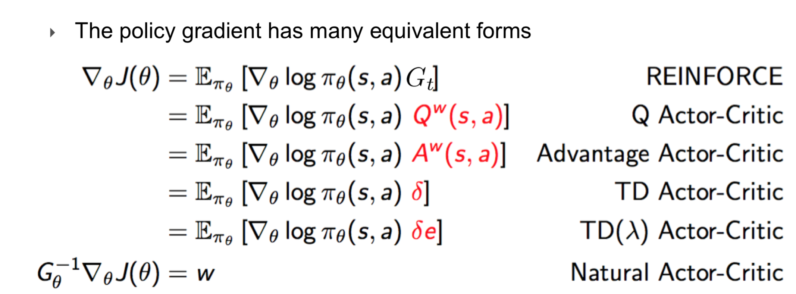
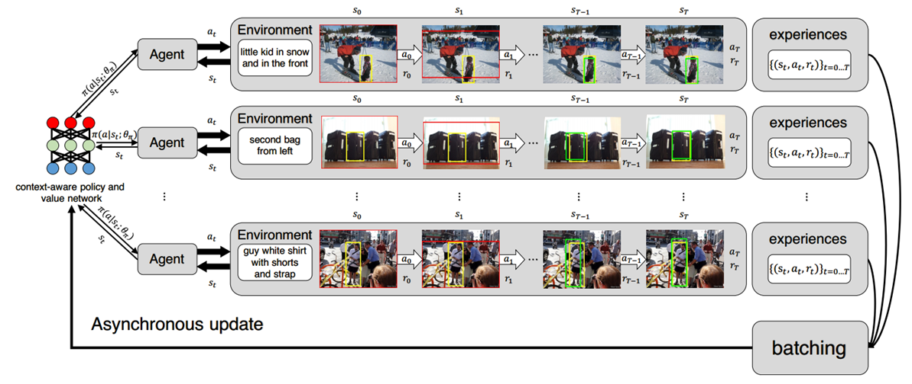
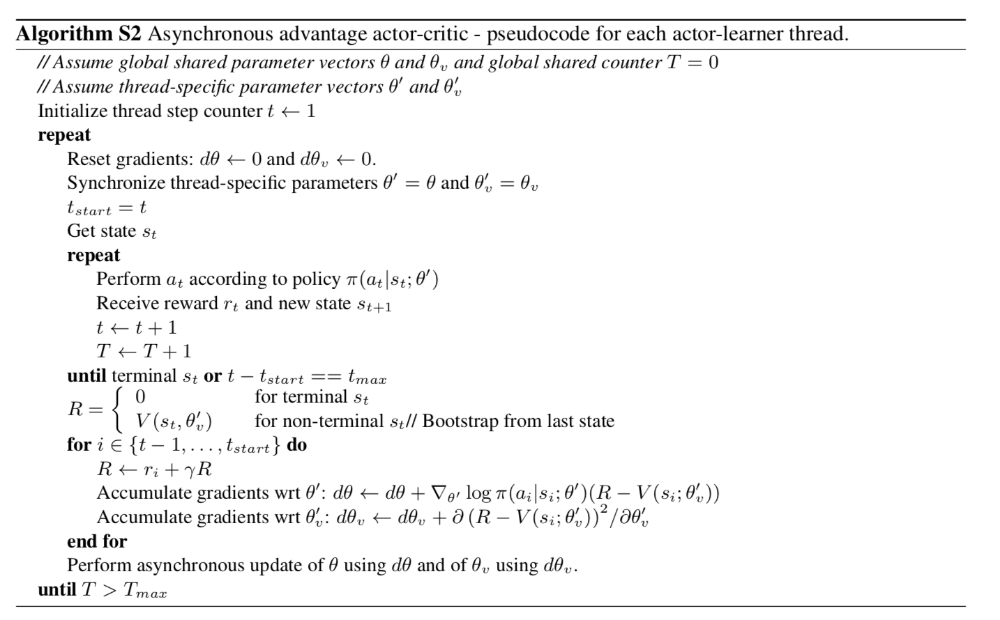
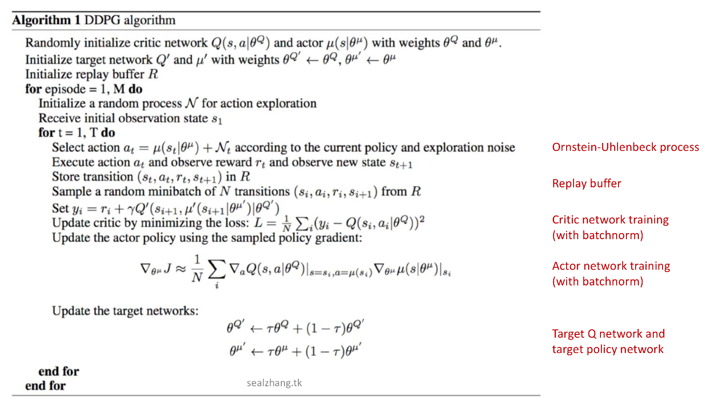

## 第七讲：强化学习策略梯度类方法

### 目录

* 让策略梯度形式简单 —— Policy Gradient Theorem
* 用最简单的采样方法来实现 —— REINFORCE
* 两个网络一台戏 —— Actor-Critic
* 应用到高维行动空间 —— DPG
* 策略梯度类也可以玩Atari —— 从DQN到DDPG

### 引言

强化学习领域最为核心的问题是**控制问题**（control problem），即找到一个好的策略，使得个体按照这个策略进行行动能够在期望上取得最大的收益。而强化学习基础的数学模型就是MDP，当这个MDP足够简单的时候，我们就可以使用**基于解析的方法**找到最优策略，比如Linear Programming类的方法和前面介绍到的Dynamic Programming类的算法。不过在现实应用中遇到的强化学习问题常常都比较复杂，因此，我们需要采用**基于采样的方法**。我们这里的第六讲、第七讲和第八讲都是属于这一类。

我们上一讲就是介绍的这一类基于状态价值函数$V(s)$或者行动价值函数$Q(s,a)$的控制问题解法，这里称之为策略迭代类算法，或者叫做**基于价值函数的方法**（value-based method）。价值函数衡量了在某个状态或者采取某个行动之后能够取得的收益。在确定性的环境中，当我们知道了每个状态价值函数$V(s)$的数值之后，策略就可以选择使得下一个状态期望状态价值函数最大的行动$a$。在随机的环境中，状态价值函数$V(s)$就不太好用了，因为它不能直接指导我们进行行动的选择。在控制问题中更常用的是行动价值函数$Q(s,a)$，它描述了在某个状态$s$下采取不同的行动$a$产生的期望收益，这样我们的最优策略就可以写成$\pi(a\|s) = arg\max\_{a'} Q(s,a')$。

在这一讲中用另外一种更为直接方式来解决强化学习中的控制问题——策略梯度类方法，它属于另外一类，即**基于策略的方法**（policy-based method）。基于价值函数的方法是先估计得到价值函数，然后直接依赖价值函数找到对应的最优策略。而基于策略的方法更为直接，直接参数化策略，然后对着一个性能评价函数去优化控制策略的参数，如果使用梯度上升方法来进行优化，那么得到的就是我们这一讲里面要了解到的**策略梯度类方法**（policy gradient method）；如果使用一些无导数优化方法来优化这些控制策略的参数，那么得到的就是我们下一讲里面会讲到的**无导数优化方法**（derivative-free method）。

### 让策略梯度形式简单 —— Policy Gradient Theorem

前面已经说到基于策略的方法就是直接把策略$\pi(s,a)$进行参数化表述，即$\pi(s,a\|\theta)$，为了保证参数化的结果能够满足概率的归一化条件，一般令$\pi(s,a\|\theta) = \dfrac{\exp(h(s,a))}{\sum\_{a'} \exp(h(s,a'))}$。如果是线性参数化那么$h(s,a\|\theta) = \phi(s,a)^T \theta$；如果使用神经网络，为了保证概率的归一化条件，网络$\pi(s,a\|\theta)$的最后一层需要设定为softmax层。

接下来定义策略性能的度量。
1. 对于回合制任务，可以定义性能的度量为一回合中能够取得的总收益，$J(\theta) = \mathbb{E}[\sum\_{k=1}^T R\_k]$
1. 对于回合制任务，也可以在回合制任务里面引入衰减率，来更多地强调近期的收益，即$J(\theta) = \mathbb{E}[\sum\_{k=1}^T \gamma^{k-1} R\_k]$
1. 对于连续任务，由于任务不会终结，那么总收益常常会发散，这时就必须加入衰减率，来保证其收敛，这样可以得到相应的性能度量，$J(\theta) = \mathbb{E}[\sum\_{k=1}^\infty \gamma^{k-1} R\_k]$
1. 对于连续任务，如果希望长期收益能和近期收益一样重要，即$\gamma=1$，这样如果直接使用上面的定义会导致$J(\theta)$发散；这时可以使用平均每步收益来作为性能的度量，即$J(\theta) = \lim\_{t\to \infty} \dfrac{1}{t} \mathbb{E}[\sum\_{k=1}^T R\_k] = \lim\_{t\to \infty} \mathbb{E}[R\_k]$

做好了策略的参数化$\pi(s, a\| \theta)$并且定义好了策略性能的度量$J(\theta)$之后，我们就自然想到使用梯度上升方法来进行参数的更新，$\theta \leftarrow \theta + \alpha \nabla\_\theta J(\theta)$。

那么下面的问题就转化为了如何计算$\nabla\_\theta J(\theta)$。为了简洁起见，从现在开始使用第一种定义$J(\theta) = \mathbb{E}[\sum\_{k=1}^T R\_k]$，之后我们再说明其他定义对应的情况。为了去对$J(\theta)$求$\theta$的梯度，我们至少要把$J(\theta)$写成含有$\pi(s, a\| \theta)$的形式吧。下面我们就开始做这件事情。

$$
J(\theta) = \sum_s \rho_\pi(s) \sum_a \pi(s, a | \theta) Q_\pi(s, a)
$$

其中$\rho\_\pi(s) = \sum\_{s'} \sum\_{t=0}^{T-1} p\_0(s') p(s' \to s, t, \pi)$是策略$\pi$下的状态密度，它表示在一个回合中个体处于状态$s$的期望次数。之前的$J(\theta)$是一个时序上连续的收益和的形式，现在我们把它按照状态$s$和行动$a$拆开分别统计，并且对状态$s$和行动$a$分别加上了$\rho\_\pi(s)$和$\pi(s, a \| \theta)$的权重。

现在就产生了一个担忧。当策略进行更新的时候，可能因为选择了更好的行动而使得$\pi(s, a \| \theta) q\_\pi(s, a)$变得更大，即在这个状态上能够获得更大的期望收益；但与此同时，策略的改变也会影响策略下的状态密度$\rho\_\pi(s)$，这时策略的总体性能是否能够保证变得更好就需要存疑了。换句话说，如果解析地对于$J(\theta)$求梯度，我们希望表达式里面只含有对于策略的梯度$\nabla\_\theta \pi(s, a\|\theta)$，因为不管是线性的参数化还是神经网络，梯度计算都非常的方便；如果得到的表达式里面如果含有状态密度$\rho\_\pi(s)$相对于参数$\theta$的导数就非常的不好办了，这样基本上没法计算。

下面要引出的**策略梯度定理**（policy gradient theorem）就给咱们带来了一个好消息，即$J(\theta)$的梯度不含有状态密度相对参数的梯度。

$$ \nabla J(\theta) = \sum_s \rho_\pi(s) \sum_a \nabla \pi(s, a, \theta) Q_\pi (s, a)$$

形式上来看就是直接把求导放到了$\pi(s, a, \theta)$，但是推导过程并不是这么得无聊，具体推导见[1]。

对于$J(\theta)$的第二种和第三种定义来说，与此的主要区别就是加入了衰减率，衰减率可以整理写到$\rho\_\pi(s)$中，即$\rho\_\pi(s) = \sum\_{s'} \sum\_{t=0}^{(\cdot)} \gamma^t p\_0(s') p(s' \to s, t, \pi)$，其中$(\cdot)$可以分别写出回合制和连续任务的形式。其对应的策略梯度定理和上面是完全一样的形式。值得注意的是，如果初始的概率分布$p\_0(s)$和策略$\pi$下的稳定分布$\mu\_\pi(s)$一致，那么不管是否有加衰减率，都有$\rho\_\pi(s) \propto \mu\_\pi(s)$。

对于第四种定义来说，也可以写出同样形式的策略梯度定理，只不过此时$Q\_\pi(s,a) = \mathbb{E}[G\_t\|S\_t = s, A\_t = a, \pi]$的定义稍有不同，其中的$G\_t$不再是$t$时刻之后的总收益，而是$t$时刻之后的差分收益（differential return），$G\_t = R\_{t+1} - J(\theta) + R\_{t+2} - J(\theta) + \cdots$。

### 用最简单的采样方法来实现 —— REINFORCE

通过策略梯度定理得到了策略梯度的表示形式，注意到表达式中涉及到对于所有状态和所有行动的求和，这样的求和的计算量是很大的，如果我们能够把它进一步化成某个策略下的期望的形式，就可以通过采样的方式来对梯度进行估计了。根据前面提到的性质，假设初始状态分布和策略$\pi$下稳态分布一致，那么$\mu\_\pi(s) = \rho\_\pi(s)$。

$$
\nabla J(\theta) = \sum_s \mu_\pi(s) \sum_a  \pi(s, a, \theta) \dfrac{\nabla \pi(s, a, \theta)}{\pi(s, a, \theta)} Q_\pi (s, a) = \mathbb{E}_\pi[\nabla \log \pi(s, a, \theta) Q_\pi (s, a)]
$$

期望内的表达式就是对于策略梯度的一个估计，现在还需要计算$Q\_\pi(s,a)$，可以使用蒙特卡洛方法采样得到从$(s,a)$开始的收益$G\_t$，它是一个$Q\_\pi(s,a)$的无偏估计，由此得到的$G\_t \nabla \log \pi(s,a,\theta)$也是策略梯度的一个无偏估计。由此得到REINFORCE算法更新公式

$$\theta \leftarrow \theta + \alpha G_t \nabla \log \pi(S_t, A_t, \theta)$$

注意到只有当一个回合结束之后我们才能得到该轨迹上各个状态对应的$G\_t$，因此，该方法需要先采样一个完整的轨迹，然后再倒回来对每个状态更新参数。

该方法是无偏的，但是方差非常大，所以运行速度也很慢，在原文[2]中就提出了使用baseline来减少方差，这主要基于一个观察，即在行动价值函数$Q\_\pi(s,a)$上减去任意一个只与状态有关的函数$b(s)$不影响策略梯度估计的期望，但是能选择一个这样的函数使得其方差最小。

$$
\begin{aligned}
\sum_s \mu_\pi(s) \sum_a \nabla \pi(s, a, \theta) b (s) & = \sum_s \mu_\pi(s) b(s) \sum_a \nabla_\theta \pi(s, a, \theta) \\
& = \sum_s \mu_\pi(s) b(s) \nabla_\theta \sum_a \pi(s, a, \theta) \\
& = \sum_s \mu_\pi(s) b(s) \nabla_\theta 1 = 0
\end{aligned}
$$

那么怎样选择baseline呢？在[6]里面证明了（在线性近似下）选择状态$s$上的状态价值函数$V(s)$作为baseline能够最大程度减小方差。这样，算法还需要同时维护一个参数$w$控制的状态价值函数$v(s, w)$用于baseline。该价值函数的估计使用蒙特卡洛方法，这样我们就得到REINFORCE with baseline的更新公式

$$
\begin{aligned}
w & \leftarrow w + \alpha^w (G_t - v(S_t, w)) \nabla_w w(S_t, w) \\
\theta & \leftarrow \theta + \alpha^\theta (G_t - v(S_t, w)) \nabla_\theta \log \pi(S_t, A_t, \theta)
\end{aligned}
$$

注意到两个公式里面都出现了$(G\_t - v(S\_t, w))$一项，但是其含义并不完全相同。状态价值函数参数$w$更新公式中的该项是对误差$(G\_t - v(S\_t, w))^2$求导得到的，函数逼近加上蒙特卡洛方法就会产生这一项；策略参数$\theta$更新公式中出现的这一项是原本的更新目标$G\_t$减去baseline $ v(S\_t, w)$的结果。

最后回答两个困扰过我的问题：

1. **名字叫做policy-based method为什么还是涉及到价值函数的估计？**policy-based和value-based的区别主要在于最后形成的策略是直接由参数控制的还是通过价值函数衍生出来的（比如相对于价值函数的greedy策略）。policy-based方法里面仍然可以用到价值函数的估计，只要最后的策略是直接由参数控制的，就不影响它称作policy-based method。
2. **为什么Sutton书中（section 13.4）的REINFORCE算法更新公式中梯度上会乘上$\gamma^t$项？**书里面为了推导方便，假设了每一个回合的初态都是$s\_0$，这就会导致远离$s\_0$的态会因为衰减的缘故不那么重要，因此对于远离$s\_0$的态需要减小其重要性。这里假设了初态分布和策略下的稳态分布相同，使用策略作用一步前后态的分布不变，这样每一个采样到的态不需要额外再加权重，就没有类似$\gamma^t$项。对于遍历的MDP来说，可以先按照策略$\pi$走足够多步，这样得到的分布可以认为差不多是$\mu\_\pi(s)$，然后再从此开始。

### 两个网络一台戏 —— Actor-Critic

#### Advantage Actor-Critic (A2C)

REINFORCE方法基于采样，它是无偏的，但是它最大的问题是方差大，由此收敛缓慢。要解决收敛慢的问题，就需要用到武器库中的bootstrapping。也就是说，采样得到的$G\_t$使用相应的bootstrapped收益来使用$R\_{t+1} + \gamma v(S\_{t+1}, w)$代替。（注意，这里不加说明地加上了衰减率$\gamma$）这样得到的更新公式和REINFORCE with baseline形式上类似

$$
\begin{aligned}
w & \leftarrow w + \alpha^w (R_{t+1} + \gamma v(S_{t+1}, w) - v(S_t, w)) \nabla_w w(S_t, w) \\
\theta & \leftarrow \theta + \alpha^\theta (R_{t+1} + \gamma v(S_{t+1}, w) - v(S_t, w)) \nabla_\theta \log \pi(S_t, A_t, \theta)
\end{aligned}
$$

同样，要注意第一个式子中的$(R\_{t+1} + \gamma v(S\_{t+1}, w) - v(S\_t, w))$是semi-gradient TD(0)方法中的TD error，后面一个式子中的$(R\_{t+1} + \gamma v(S\_{t+1}, w) - v(S\_t, w))$是bootstrapped target减去了baseline，形式上也是TD error。使用状态价值函数作为baseline其实就是使用了前面提到的Advantage$A(s,a) = Q(s,a) - V(s)$作为目标，这样的方法也叫做**Advantage Actor-Critic (A2C)**。

这里的策略网络$\pi(s,a,\theta)$就好像一样演员一样进行“表演”，而价值函数网络$v(s, w)$就好像批评家一样在对其表演进行评判，因此我们把这样的方法称作actor-critic方法。注意到前面的REINFORCE（with baseline）不是actor-critic方法，因为其中的价值函数网络并没有作为策略网络更新的目标，而仅仅是作为baseline出现的。只要价值函数网络以任何形式出现在目标中（即原来$G\_t$的位置上），都是actor-critic方法，下图列出了各种不同actor-critic方法用到的策略梯度。

#### Asynchronous Advantage Actor-Critic (A3C)

我们下面再介绍一种表现更为优秀的算法，**Asynchronous Advantage Actor-Critic (A3C)**[7]。它是异步版本的A2C算法，其异步的方法是使用带不同探索参数的不同的CPU来采样，每个CPU上的采样积累到一定的数量之和再一起拿去更新网络参数。具体的示意图和算法如下图所示。

这样异步算法有如下一些好处：
1. 强化学习算法不稳定很大程度上是由于强化学习得到一连串的数据之间具有相关性，只有打破只有的相关性才能得到一个稳定的算法。前面了解到的DQN就是使用了经验池的方法来打破数据时间的相关性，通过从经验池里面采样，使得相关性较低的样本能够在同一个batch里面用来更新价值函数。这里使用了异步的方法来打破数据之间的相关性，多个actor探索到的经历不同，这样actor之间的样本相关性就降低了，从而稳定了算法。而且经验池的使用要求使用off-policy的方法，而采取异步的方法则可以使用更稳定的on-policy方法。
1. 在不同的actor上能够分别采用不同的探索参数，从而增加全局探索的多样性；同时，实际上不同的actor也能够去探索环境的不同部分。

#### Natural Actor-Critic

再来介绍一下Natural Actor-Critic[6]。做梯度上升的时候一般希望每次都在当前位置附近朝着梯度下降的方向前进一小步，在策略梯度方法里面即希望每次更新之后策略$\pi(s,a,\theta)$的变化都不要太大。由于使用了非线性的神经网络来拟合这个策略，因此在参数空间中的一小步$\Delta \theta$并不能保证它在策略空间也是一小步；并且可能在参数空间的不同方向的长度相同的两步，在策略空间可能一个只会引起很小的变化，另一个却会引起很大的变化。因此，我们希望在策略空间的邻域中找到梯度上升最大的一个方向进行更新，而不是在参数空间中做梯度上升。注意到策略空间是一个概率分布，因此使用KL-divergence来衡量策略空间的距离；又由于KL-divergence不满足距离的对称性要求，因此使用KL-divergence的二阶近似来作为距离

$$
KL(\pi(\theta) || \pi(\theta+\delta \theta)) \approx \dfrac{1}{2} \sum_{i,j} G_{ij}(\theta) \delta \theta_i \delta \theta_j
$$

其中

$$
G_{ij}(\theta) = \int_s \int_a \dfrac{\partial \pi(s, a, \theta)}{\partial \theta_i} \dfrac{\partial \pi(s, a, \theta)}{\partial \theta_j} \pi(s, a, \theta) ds da
$$

是参控策略的Fisher Information Matrix。约束策略变化在一个小的邻域内，就可以得到参数应该更新的方向，得到参数的更新公式

$$
\theta \leftarrow \theta + G(\theta)^{-1} \nabla J(\theta)
$$

#### Compatible Actor-Critic

从策略梯度定理可以得到$\nabla\_\theta J(\theta) = \mathbb{E}\_{s\sim \rho\_\pi, a\sim \pi}[\nabla \log \pi(s, a, \theta) Q\_\pi (s, a)]$。如果使用蒙特卡洛采样$G$来估计$Q\_\pi (s, a)$那么可以保证得到的梯度是无偏估计；但是如果使用函数逼近产生的$\hat{Q}\_\pi (s, a, w)$来估计，是否还是无偏的呢？目前为止只找到了一种线性近似的方式能够保证这样的估计仍然是无偏的，这样的线性近似的方式我们称之为**compatible function approximator**[10]，它需要满足以下条件
1. $\hat{Q}\_\pi (s, a, w) = \nabla\_\theta \log \pi (s, a, \theta)^T w$
1. $w = arg\min \epsilon^2 (w) = arg\min \mathbb{E}\_{s\sim \rho\_\pi, a\sim \pi} [(\hat{Q}\_\pi (s, a, w) - Q\_\pi (s, a))^2]$

使用这样的Q函数作为目标来更新策略网络参数$\theta$，再使用比如$TD(0)$等方法来更新Q网络的参数$w$，这样得到的算法就称作**Compatible Actor-Critic**。

### 应用到高维行动空间 —— DPG

对于行动空间离散的情况，策略网络$\pi(s,a,\theta)$的输入可以是状态$s$，对应的输出可以是每个行动对应的概率。但是对于高维度的行动空间或者连续的行动空间，输出端不可能为每一个行动都新增一个维度。这篇文章[8]就提出使用确定性的策略网络$\mu: \mathcal{S} \to \mathcal{A}$，即网络输入一个状态$s$，输入相应的一个行动$a$，这样就能够处理高维度和连续的行动空间了。在策略网络是随机性的时候，我们推导得到了（随机性）策略梯度定理$\nabla\_\theta J(\theta) = \mathbb{E}\_{s\sim \rho\_\pi, a\sim \pi}[\nabla \log \pi(s, a, \theta) Q\_\pi (s, a)]$，当策略变成确定性了之后，是否也有对应的确定性策略梯度定理呢？直观地来想，如果有这样一个定理，那么期望上对于$a\sim \pi$的平均应该就能够被去掉，这样也简化了期望的计算。

下面就来介绍文章中推导得到的**确定性策略梯度定理**（Deterministic Policy Gradient Theorem）。和（随机性）策略梯度定理的推导类似，把第一个状态的价值函数梯度展开，并用后续状态的价值函数梯度表示，然后把关于相同状态$s$的项收集起来，这样就能够得到最后的策略梯度定理了。确定性策略梯度定理的表述如下

$$
\nabla_\theta J(\theta) = \sum_s \rho^{\mu}(s) \nabla_\theta \mu(s, \theta) \nabla_a Q_\mu(s, a) |_{a=\mu(s,\theta)} = \mathbb{E}_{s\sim \rho^{\mu}}[\nabla_\theta \mu(s, \theta) \nabla_a Q_\mu(s, a) |_{a=\mu(s,\theta)}]
$$

如果策略是确定性的，再加上一般环境的噪声也不是十分巨大，那么确定性策略梯度方法必然会遇到一个问题，那就是策略的探索不足。这时我们再取出武器库中的off-policy。在off-policy下可能得到近似的策略梯度

$$
\nabla_\theta J(\theta) = \mathbb{E}_{s\sim \rho^{\beta}}[\nabla_\theta \mu(s, \theta) \nabla_a Q_\mu(s, a) |_{a=\mu(s,\theta)}]
$$

这样就得到了off-policy下的确定性actor-critic方法（off-policy deterministic actor-critic, OPDAC）

$$
\begin{aligned}
w_{t+1} & \leftarrow w_t + \alpha_w \left( r_t + \gamma Q(s_{t+1}, \mu(s_{t+1}, \theta_t), w_t) - Q(s_t, a_t, w_t) \right) \nabla_w Q(s_t, a_t, w_t) \\
\theta_{t+1} & \leftarrow \theta_t + \alpha_\theta \nabla_\theta \mu(s_t, \theta_t) \nabla_a Q(s_t, \mu(s_t), w_t)
\end{aligned}
$$

### 策略梯度类也可以玩Atari —— 从DQN到DDPG

Atari中有一部分游戏的状态空间是离散的，比如对应控制方向的上下左右或者游戏手柄中经常出现的“OX△□”等；但是也有一些有些的行动空间连续的，比如控制施加到小车上面的力。DQN玩的Atari游戏每次都从从18种可能的操作里面选取一种操作来进行，而这篇工作[9]玩的Atari游戏则是输出多维度的连续实数来操作。前面介绍的deterministic policy gradient正好适合这样连续操作的任务，而DQN相关工作引入的一些包含experience replay、target network在内的各种技术又能在更好的保证算法的稳定性。因此这篇工作希望把两者的优势相结合，在连续控制的Atari游戏上得到好的性能。

在我们已经了解了DQN和DPG之后，DDPG就很好理解了，其算法如下图所示。其主要在我们前面介绍的OPDAC上用到了experience replay，target network和batch norm等技术，它是off-policy的算法，行动策略是在目标策略技术上加入噪声的策略。

### 小结

这一讲主要介绍了一些基本的策略梯度方法，它是不同于前面介绍的基于价值函数的方法的另一类方法。

我们先引出了策略梯度类方法的一个基石——策略梯度定理，它告诉了我们策略梯度的具体形式。接着我们先用采样的方法来估计策略梯度，得到了REINFORCE算法；然后我们使用了bootstrap这个武器，得到了actor-critic类方法，大大提高了计算的效率；接下来为了面对连续的状态空间，我们推导出了确定性的策略梯度方法，并且使用off-policy这个武器解决了确定性策略策略梯度方法探索不足的问题；最后我们介绍了一个在Atari上的一个应用DDPG。

下一讲我们会讲到一些更为高级的策略梯度方法和一些无导数优化方法。

策略梯度类方法的相比于基于价值函数的方法有以下的优势：

1. 有一些任务的最优策略是一个随机性的策略，策略梯度方法直接参数化了策略$\pi(s,a)$，因此可以表示出这样的随机性策略；而基于价值函数的方法通过价值函数来贪心地得到策略，无法表示出来这样的随机性策略。当然，有类似$\epsilon$-greedy的随机性策略，但是这样的随机性策略不能自然地过渡到确定性策略上；
1. 基于价值函数的方法在每一个状态上如何选择出最好的行动呢？它们会比较该状态上每一个行动产生的下一个状态的期望$V(s')$或者比较每个行动的$Q(s,a)$，从而挑选出最好的行动。但是如果行动空间是连续的或者组合多的，在每个状态上的行动挑选就会变得几乎不可能。但是基于策略的方法就不会产生这样的问题，因为这类方法可以直接给出一个策略，策略接受状态$s$之后就会输出相应的行动$a$；
1. 有些时候直接参数化策略比参数化价值函数可能更简单；
1. 直接参数化策略可以方便地把我们对于策略的偏好或者先验知识加进来；

目前学习到的算法

| Method     | Boostrap | On/Off-policy  | Model-based/free | Function Approximate | Policy/Value-based | Notes |
|:-----------|:---------|:---------------|:-----------------|:---------------------|:-------------------|:----------|
| Gradient TD | Yes  | Off-policy     | Model-free       | Linear               | Value-based        | $\overline{PBE}$ objective for stability |
| Emphatic TD | Yes  | Off-policy     | Model-free       | Linear               | Value-based        | Adjust effective distribution for stability |
| DQN         | Yes      | Off-policy     | Model-free       | Neural Network       | Value-based        | Do DRL in a stable way |
| REINFORCE[2]  | No       | On-policy      | Model-free       | Non-linear           | Policy-based       | MC sampled target |
| Actor-Critic | Yes    | On-policy (can be off-policy as well) | Model-free | can be non-linear | Policy-Based | Has many variants|
| DPG[8]       | Yes    | Basically off-policy | Model-free | Linear               | Policy-based       | For continuous action space |
| DDPG[9]      | Yes    | Off-policy     | Model-free       | Neural Network       | Policy-based       | Continuous controlled Atari |

### 参考文献

[1] Sutton, Richard S., and Andrew G. Barto. Reinforcement learning: An introduction. MIT press, 1998.

[2] Williams, Ronald J. "Simple statistical gradient-following algorithms for connectionist reinforcement learning." Machine learning 8.3-4 (1992): 229-256.

REINFORCE文章

[3] https://zhuanlan.zhihu.com/p/32596470

知乎：AC与A3C的讲解

[4] Degris, Thomas, Patrick M. Pilarski, and Richard S. Sutton. "Model-free reinforcement learning with continuous action in practice." American Control Conference (ACC), 2012. IEEE, 2012.

AC用于连续状态空间和Eligibility Trace

[5] https://www.zhihu.com/question/266846405

知乎：如何理解natural gradient descent

[6] Bhatnagar, Shalabh, et al. "Natural actor–critic algorithms." Automatica 45.11 (2009): 2471-2482.

Natural AC，包含许多理论上的结论，比如不同AC之间的等价性、证明最优的AC baseline是state value function、boostrapped AC收敛性的证明等。

[7] Mnih, Volodymyr, et al. "Asynchronous methods for deep reinforcement learning." International conference on machine learning. 2016.

A3C文章

[8] Silver, David, et al. "Deterministic policy gradient algorithms." ICML. 2014.

DPG文章

[9] Lillicrap, Timothy P., et al. "Continuous control with deep reinforcement learning." arXiv preprint arXiv:1509.02971 (2015).

DDPG文章

[10] Sutton, Richard S., et al. "Policy gradient methods for reinforcement learning with function approximation." Advances in neural information processing systems. 2000.

讲到了compatible function approximator

[11] http://sealzhang.tk/assets/files/2018-05-25-DDPG.pdf

本人组会上关于DPG和DDPG的slides
